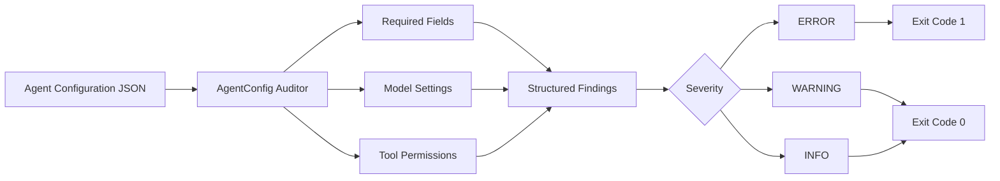
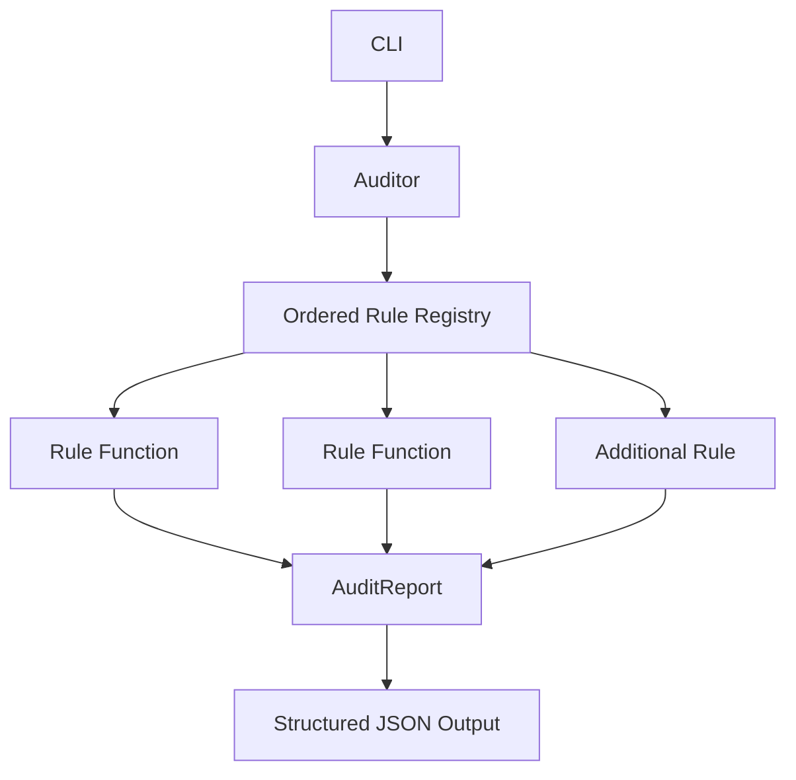

# AgentConfig Auditor

> **Deterministic preflight auditing for AI-agent configuration, with explicit checks for required structure, risky model settings, and tool-permission declarations before execution.**

| Attribute | Verified status |
|---|---|
| Evidence level | **Verified Implementation + Test-Backed Validation** |
| Implementation repository | Private |
| Verified version | `0.1.0` |
| Primary capability | AI Operations & Governance |
| Secondary capability | AI & Agentic Systems |
| Runtime | Python 3.10+ |
| Interface | CLI + structured JSON report |
| Built-in audit rules | 3 deterministic rule families |
| Latest documented validation checkpoint | 43 tests passing |

## Overview

AgentConfig Auditor is a lightweight Python tool for auditing AI-agent configuration files before those configurations are accepted as operationally ready.

The tool reads a JSON configuration, evaluates deterministic rules, and produces a structured report containing findings at `error`, `warning`, or `info` severity. It is designed to make configuration risk visible before agent execution rather than relying on runtime behavior to reveal missing controls.

The implementation repository remains private. This page publishes the architecture, rule model, validation boundary, and verified capabilities without exposing private implementation history or internal configuration data.

### Runtime audit and validation evidence


*Sanitized runtime evidence showing AgentConfig Auditor evaluating an intentionally invalid test fixture, producing six deterministic findings across required-field, model-setting, and tool-permission rules, followed by the 43-test passing validation checkpoint.*

## The problem

Agent configurations can look complete while still carrying preventable operational risk:

- required identity or prompt fields may be missing;
- model-output limits may be undefined;
- high-temperature settings may increase unpredictability;
- tools may be declared without explicit permissions;
- malformed tool declarations may pass unnoticed;
- configuration review may depend on manual inspection;
- teams may confuse a syntactically valid file with a governed configuration.

AgentConfig Auditor introduces a deterministic preflight layer between configuration authoring and execution.

**Configuration present ≠ Configuration governed. Deterministic checks make the difference explicit.**

## Audit workflow



Input and parse failures are handled separately with exit code `2`, allowing downstream automation to distinguish invalid input from an audited configuration that contains error-severity findings.

## Deterministic rule model

The current implementation contains three built-in rule families.

### Required fields

Every audited configuration must include:

- `name`;
- `model`;
- `system_prompt`.

Each missing required field produces an `ERROR` finding.

### Unsafe model settings

The current rules flag:

- `temperature` above `1.5` as a warning;
- missing `max_tokens` as a warning because model output is left without an explicit configured bound.

These are deterministic configuration checks. They do not attempt to predict model behavior or claim that one model parameter is universally unsafe in every environment.

### Tool permissions

The auditor evaluates declared tools for explicit permission configuration.

Current findings include:

- no configured tools — informational observation;
- malformed tool entries;
- missing `permissions` declaration;
- empty or non-list permission values.

The rule focuses on **explicit declaration**. It does not independently prove that a downstream runtime enforces those permissions.

## Extensible architecture

Audit rules are plain Python functions that accept a configuration object and return findings.



The rule registry is intentionally simple: additional deterministic rules can be added without redesigning the command-line interface or report model.

Project guidance defines rules as deterministic and side-effect-free so that the same input produces the same rule result.

## Structured evidence output

The audit report includes:

- configuration file reference;
- UTC audit timestamp;
- total finding count;
- stable rule identifier;
- severity;
- human-readable finding message;
- relevant configuration field when available.

This structure allows the tool to support both human review and downstream automation without requiring consumers to parse prose-only terminal output.

## CLI and automation behavior

The command-line interface supports direct auditing of a JSON configuration file.

```text
agentconfig-auditor audit <config-file>
```

The verified exit-code model is:

| Exit code | Meaning |
|---:|---|
| `0` | Audit completed with no error-severity findings |
| `1` | Audit completed with at least one error-severity finding |
| `2` | File or JSON parsing failure |

This makes the tool suitable as a deterministic preflight or pipeline gate, while leaving the actual integration policy to the calling environment.

## Validation evidence

The implementation repository contains dedicated tests for the audit engine and rule behavior, plus fixtures for representative configurations.

The published runtime evidence above records an execution against the intentionally invalid test fixture with **six findings**: two error-severity required-field findings and four warnings covering model settings and tool-permission declarations. The same evidence records **43 tests passing** immediately afterward.

The repository also contains usage and extension documentation covering command behavior, configuration format, report structure, rule conventions, and test patterns.

## Verified technology profile

| Area | Implementation evidence |
|---|---|
| Language | Python 3.10+ |
| Packaging | `pyproject.toml` / setuptools |
| CLI | `argparse` |
| Input format | JSON |
| Output format | Structured JSON |
| Audit engine | Ordered deterministic rule registry |
| Severity model | Error / Warning / Info |
| Validation | pytest test suite + fixtures |
| External runtime dependencies | None declared |
| Version control | Git / private GitHub implementation repository |

## Capabilities demonstrated

This project provides evidence of capability in:

- AI-agent configuration governance;
- deterministic validation design;
- Python CLI engineering;
- structured machine-readable reporting;
- severity-based findings models;
- explicit tool-permission review;
- model-configuration guardrails;
- automation-friendly exit-code design;
- extensible rule-engine architecture;
- automated unit testing and fixtures;
- documentation for extension and operational use.

## Deliberate boundaries

AgentConfig Auditor is not presented as a universal AI security scanner, runtime sandbox, policy-enforcement engine, model evaluator, or formal compliance product.

The following are **not** claimed as current capabilities:

- runtime enforcement of tool permissions;
- semantic analysis of system prompts;
- validation of provider-specific model availability;
- live inspection of agent behavior;
- secret scanning;
- autonomous remediation of configuration files;
- exhaustive AI safety certification;
- universal configuration-schema support beyond the implemented JSON model.

## Evidence classification

**VERIFIED IMPLEMENTATION** — the private repository contains the CLI, audit engine, data models, deterministic rules, packaging configuration, fixtures, and documentation described here.

**TEST-BACKED VALIDATION** — the repository contains dedicated automated tests for auditor and rule behavior, with published sanitized runtime evidence showing six deterministic findings from an intentionally invalid fixture and a 43-test passing validation checkpoint.

No production runtime deployment claim is made for this project.

## Disclosure boundary

The implementation repository is intentionally private. This Technical Evidence Center does not publish proprietary source code, private agent configurations, prompts, credentials, internal execution history, or sensitive operational data.

Architecture and behavior presented here are reconstructed from verified implementation and repository evidence.

## Interested in this architecture?

AgentConfig Auditor is an internal RACBCONSULTING engineering tool and evidence project, not an open-source application release.

Organizations exploring governed AI-agent configuration, deterministic preflight checks, policy-oriented validation, or safer AI automation workflows may contact RACBCONSULTING to discuss architecture, implementation, integration, or a guided technical review.

---

**Rene Canete / RACBCONSULTING**  
Technical Evidence Center
