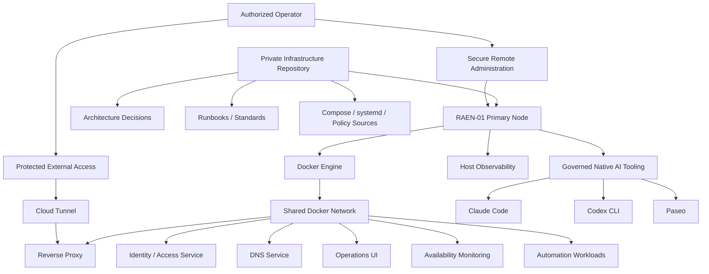
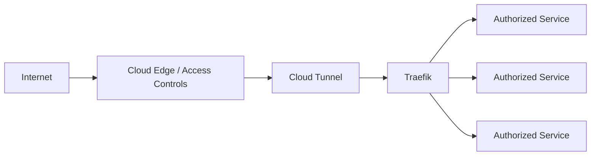
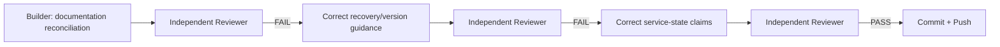

# RACB Homelab

> **A version-controlled infrastructure platform for containerized services, secure service publication, host observability, and governed AI execution tooling.**

| Attribute | Verified status |
|---|---|
| Evidence level | **Verified Implementation + Runtime Correlation + Documentation Governance** |
| Implementation repository | Private |
| Audited checkpoint | `7234544` |
| Maturity | **Validated Infrastructure Platform** |
| Portfolio role | Strong Supporting Project |
| Primary capability | Infrastructure & Operations |
| Secondary capability | AI Operations & Governance |
| Current primary node | RAEN-01 |
| Infrastructure model | Docker Compose + selected governed native host tooling |

## Overview

RACB Homelab is the foundational RACBCONSULTING infrastructure platform used to develop, validate, operate, and document infrastructure for internal systems, automation workloads, AI tooling, and technical experiments.

The platform is currently anchored by **RAEN-01**, its primary infrastructure node.

The project is managed as a version-controlled infrastructure system rather than as an undocumented server build. Docker Compose definitions, architecture decisions, operational runbooks, host-level tooling configuration, security policy sources, and recovery guidance are maintained in Git alongside the platform documentation.

The implementation repository remains private. This page publishes sanitized architectural and runtime evidence while intentionally excluding credentials, private addressing, internal routing details, usernames, filesystem paths, tunnel identifiers, and other operationally sensitive information.

### Runtime infrastructure evidence

*Sanitized Portainer evidence showing active infrastructure services and co-located RACB workloads on the current primary node. Internal addressing and published-port mappings are intentionally redacted.*

## The problem

A homelab can become difficult to trust when the running machine becomes the only source of truth.

Typical failure modes include:

- services configured manually with no recoverable definition;
- undocumented network exposure;
- runtime data mixed with source configuration;
- infrastructure drift between documentation and the live host;
- operational tools installed outside governance;
- weak evidence of what is actually running;
- security or hardening claims that are assumed rather than verified;
- historical validation being confused with current runtime state.

RACB Homelab was designed around a different operating principle:

**Infrastructure state, architectural intent, operational evidence, and documentation must remain distinguishable and traceable.**

## Platform architecture

The architecture deliberately separates containerized infrastructure from selected native host tooling while keeping both inside the same governance and documentation model.

## Infrastructure-as-code operating model

The private repository represents the platform through several complementary artifact types:

- Docker Compose definitions for implemented containerized services;
- Architecture Decision Records for significant architectural choices;
- operational runbooks and infrastructure standards;
- version-controlled `systemd` definitions for selected native tooling;
- AppArmor policy source associated with host-level sandboxing work;
- documentation for installation, validation, recovery, and known limitations.

Runtime application data is intentionally kept outside the Git repository.

This structure supports a practical rule:

**Git records the intended infrastructure state; runtime observation verifies whether the host actually matches that intent.**

### Remote infrastructure administration

*Sanitized VS Code Remote SSH evidence showing the version-controlled Homelab workspace on RAEN-01, including architecture decisions, Compose definitions, documentation, policy sources, and systemd configuration. Local operator identity is intentionally redacted.*

## Implemented infrastructure surface

The audited repository contains real definitions for the core platform services below:

| Infrastructure area | Verified implementation evidence |
|---|---|
| Container runtime | Docker Engine / Docker Compose |
| Reverse proxy | Traefik |
| Secure external publication | Cloudflare Tunnel |
| Identity and access | Authentik |
| DNS | Technitium DNS |
| Container operations | Portainer |
| Availability monitoring | Uptime Kuma |
| Workflow automation | n8n |
| Host observability | Netdata |
| Host AI execution tooling | Claude Code, Codex CLI, Paseo |

The repository also contains placeholder directories for future infrastructure components. Those placeholders are not presented here as implemented services.

## Secure service publication

HTTP services follow a controlled publication path rather than exposing container ports directly as the primary external access method.

*Sanitized Cloudflare Tunnel evidence showing multiple published application routes converging on the Homelab reverse-proxy layer. Account identity and application hostnames are intentionally redacted while the Traefik service target remains visible as architectural evidence.*

A recently versioned route also integrates the RACB Agent Factory operator interface into the same reverse-proxy publication pattern.

Private hostnames, addressing, route internals, and tunnel details are intentionally omitted from this public representation.

## Host observability

The current primary node, RAEN-01, includes dedicated host-level observability through Netdata.

*Live Netdata evidence from RAEN-01 showing CPU, memory, load, thermal, process-state, and disk I/O telemetry on the current primary node.*

The verified architecture uses host-native observability because host health cannot be inferred reliably only from inside application containers or restricted agent sandboxes.

The documented access path keeps the observability service behind the existing protected publication layer rather than treating the monitoring port itself as a public endpoint.

This distinction is operationally important:

**An agent's view of the host is evidence from that execution context, not automatically authoritative host-health telemetry.**

## Governed native AI execution tooling

RACB Homelab intentionally allows selected native host-level AI tooling where native execution is technically justified.

Current verified runtime observations on RAEN-01 include:

| Tool | Verified current state |
|---|---|
| Claude Code | Installed and operational |
| Codex CLI | Installed and operational |
| Paseo CLI / daemon | `0.7.2` / `0.7.2` |
| Paseo local daemon | Running |
| Connected daemon | Reachable |
| Claude through daemon | Available |
| Codex through daemon | Available |

Native tooling remains subject to the same architectural governance as containerized infrastructure. The repository includes dedicated installation and validation documentation plus an ADR defining the exception to the Compose-first model.

### Current service-management boundary

The current Paseo runtime contains an important documented distinction:

- the canonical `paseo.service` user unit is installed and enabled;
- that unit is currently inactive;
- the live daemon is running outside that unit in a login-session scope;
- service-managed persistence for the live daemon is therefore **not currently validated**;
- complete recovery following a full host reboot remains pending validation.

This limitation is published deliberately rather than being hidden behind a generic "operational" status.

## Historical validation versus current runtime

The repository preserves historical Paseo validation performed under earlier releases while distinguishing it from the current `0.7.2` runtime.

Historical evidence includes earlier mobile, remote-client, terminal-renderer, clipboard, and voice/dictation validation. Those historical results are not presented as if they were automatically revalidated under the current runtime.

Current claims are limited to what has been directly reconfirmed, including current CLI/daemon version, daemon reachability, and Claude/Codex availability through the daemon.

This reconciliation was independently reviewed before being committed to the infrastructure repository.

## Documentation governance evidence

The latest documentation reconciliation followed a Builder / independent Reviewer workflow:

The review sequence identified and corrected, among other issues:

- an unreproducible `@latest` recovery command;
- an invalid Bash placeholder in recovery guidance;
- wording that could imply the inactive `systemd --user` unit currently manages the live daemon;
- insufficient separation between current runtime observations and historical validation.

The final reviewed change passed `git diff --check`, remained documentation-only except for comment changes in a non-active candidate unit, and was committed after independent `PASS`.

This is evidence of documentation governance, not an external certification.

## Architecture decision discipline

The repository contains a substantive ADR history covering platform decisions, including the controlled use of native host-level agent tooling.

The ADR model helps separate:

- what the platform currently does;
- why an architectural exception exists;
- what remains experimental or candidate-only;
- what must still be validated before being treated as operational truth.

A preserved hardened Paseo unit exists as a candidate artifact only. It is not presented as the active production configuration.

## Security-oriented design boundaries

The verified platform demonstrates several security-oriented practices without claiming a complete hardened or zero-trust environment:

- credentials and runtime secrets are excluded from Git;
- persistent application data is separated from source configuration;
- protected external publication is routed through a tunnel and reverse proxy layer;
- administrative and observability services are not represented as directly Internet-exposed host ports;
- host-level tooling requires explicit documentation and architectural justification;
- an AppArmor policy source exists for Codex sandbox-related work;
- security and sandbox validation gaps remain documented rather than converted into unsupported claims.

Effective AppArmor enforcement, full Codex sandbox validation, disaster recovery, high availability, and complete reboot recovery are **not** claimed as validated by this evidence.

## Repository governance evidence

A previous experimental orchestration branch was deliberately quarantined rather than merged after review identified blocking defects involving tool compatibility, a self-failing secret gate, and lifecycle behavior that did not match the intended contract.

That history demonstrates an important infrastructure-governance behavior:

**A substantial implementation is not accepted merely because it exists or has tests; failed architectural or operational review can keep it out of the mainline.**

The quarantined work is not presented as part of the active RACB Homelab platform.

## Verified technology profile

| Area | Implementation evidence |
|---|---|
| Host platform | Linux |
| Container platform | Docker Engine + Docker Compose |
| Reverse proxy | Traefik |
| Secure publication | Cloudflare Tunnel / access layer |
| Identity | Authentik |
| DNS | Technitium DNS |
| Operations | Portainer |
| Availability monitoring | Uptime Kuma |
| Host observability | Netdata |
| Automation | n8n |
| Agent tooling | Claude Code, Codex CLI, Paseo |
| Native service management | systemd user/service definitions |
| Host policy source | AppArmor |
| Infrastructure source of truth | Git |
| Architecture governance | ADRs + runbooks + standards |

## Capabilities demonstrated

This project provides evidence of capability in:

- Linux infrastructure administration;
- Docker and Docker Compose platform engineering;
- reverse-proxy architecture;
- secure tunnel-based service publication;
- identity-aware infrastructure design;
- DNS and internal service architecture;
- host and service observability;
- infrastructure-as-code discipline;
- architecture decision records and operational runbooks;
- runtime-versus-documentation reconciliation;
- controlled integration of native AI tooling;
- technical evidence and validation governance;
- maintaining explicit boundaries between verified, historical, candidate, and unvalidated states.

## Deliberate boundaries

RACB Homelab is not presented as a highly available production cluster or as an externally certified security platform.

Current verified boundaries include:

- one current primary infrastructure node, RAEN-01;
- no HA claim;
- no disaster-recovery certification;
- complete host-reboot recovery still pending validation;
- Paseo service-managed persistence not currently validated;
- effective AppArmor enforcement remains to be confirmed;
- several future Compose directories are placeholders only;
- historical client validation is not automatically treated as current-version validation;
- co-located project workloads do not imply those projects are infrastructure components of the homelab itself.

## Evidence classification

**VERIFIED IMPLEMENTATION** — repository structure, real Compose definitions, ADRs, runbooks, standards, systemd definitions, policy source, and infrastructure documentation are represented in the private repository.

**RUNTIME CORRELATION** — direct host validation confirms the current Docker/runtime platform, active core services, host observability, current Paseo runtime, and current Claude/Codex availability through the daemon on RAEN-01.

**DOCUMENTATION GOVERNANCE** — current-state documentation was reconciled against runtime observations and passed an independent review cycle before commit.

**HISTORICAL EVIDENCE** — earlier validation remains preserved with its original version context rather than being silently rewritten as current-state verification.

## Disclosure boundary

The implementation repository is intentionally private. This Technical Evidence Center does not publish credentials, private IP addresses, internal DNS maps, usernames, local filesystem paths, tunnel/session identifiers, complete routing rules, private topology details, or sensitive runtime artifacts.

Architecture presented here is reconstructed and sanitized from verified repository and runtime evidence.

## Interested in this architecture?

RACB Homelab is an internal RACBCONSULTING infrastructure platform, not a public infrastructure template or open-source distribution.

Organizations working through infrastructure standardization, Docker-based internal platforms, secure service publication, AI development environments, observability, or infrastructure governance may contact RACBCONSULTING to discuss architecture, implementation, operational review, or modernization.

---

**Rene Canete / RACBCONSULTING**  
Technical Evidence Center
