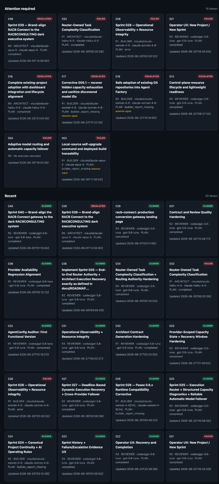
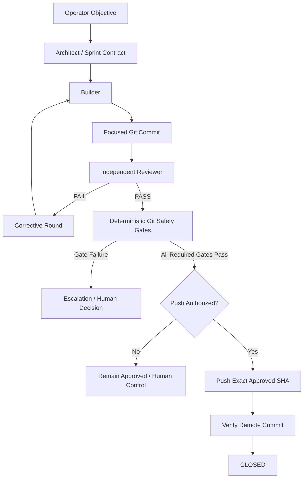
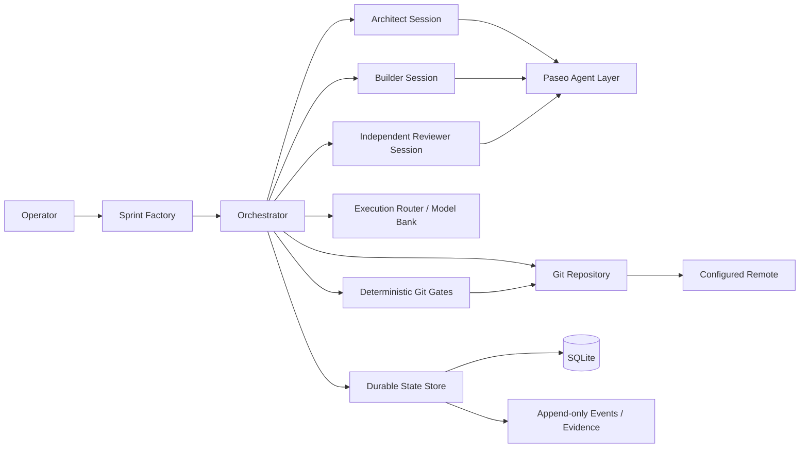
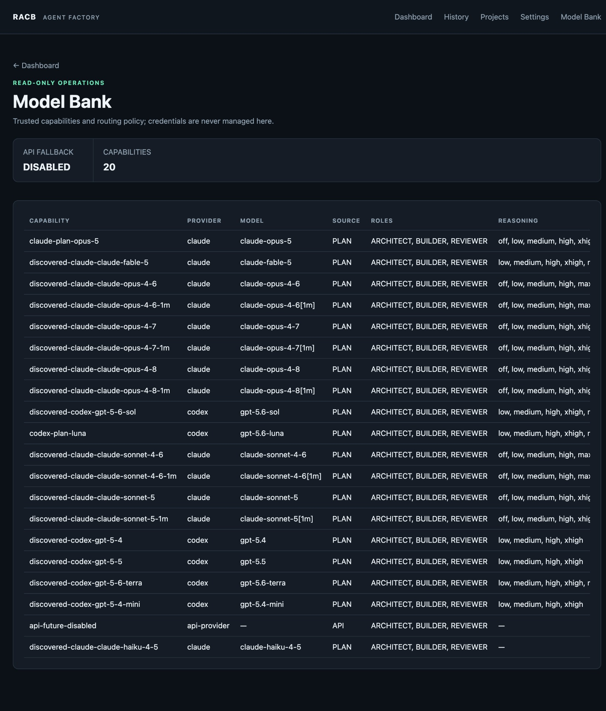
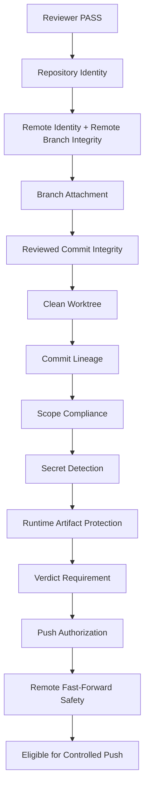
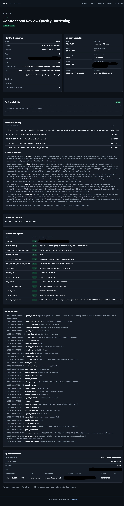
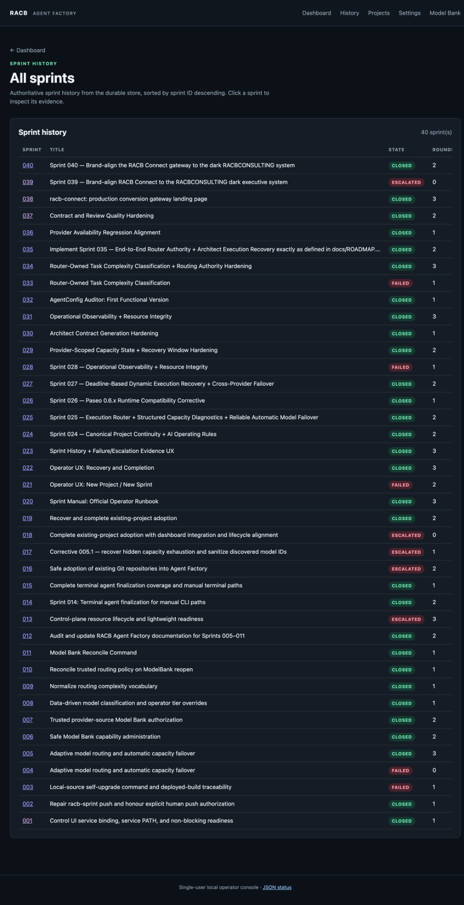

# RACB Agent Factory

> **Governed agentic software delivery with independent review, deterministic Git safety controls, persistent execution evidence, and verified end-to-end delivery.**

| Attribute | Verified status |
|---|---|
| Evidence level | **Verified Implementation + Live Validation** |
| Implementation repository | Private |
| Verified version | `1.0.0` |
| Primary capability | AI & Agentic Systems |
| Secondary capability | AI Operations & Governance |
| Delivery model | Architect / Builder / independent Reviewer |
| Git safety controls | 14 deterministic gates |
| Latest documented full-suite verification | 761 tests run, 2 skipped, 0 failures, 0 errors |

## Overview

RACB Agent Factory is a proprietary RACBCONSULTING system for governed AI-assisted software delivery.

It addresses a practical problem with agentic engineering: an AI agent may be capable of writing useful code, but capability alone does not establish authority to change a repository, approve its own work, or push changes to a remote.

Agent Factory separates those responsibilities. Work is bounded by a sprint contract, implementation is performed by a Builder, review is performed independently, deterministic controls evaluate repository state after review, and only an explicitly authorized, verified commit may progress to push and closure.

The implementation repository remains private. This page publishes sanitized architectural and validation evidence rather than proprietary source code.

### Operator control surface

*Sanitized Control UI evidence showing the operational sprint surface and governed execution state.*

## The problem

AI coding agents introduce useful execution capacity, but unattended delivery also creates operational risks:

- scope drift;
- unreviewed commits;
- accidental credential exposure;
- dirty or inconsistent repository state;
- agents modifying the remote destination;
- provider failures or capacity exhaustion;
- review and execution authority becoming conflated;
- weak evidence of what actually happened;
- a successful model response being mistaken for a safe deployment decision.

RACB Agent Factory was designed around a different principle:

**AI execution may be automated. Authority, evidence, review, and safety remain explicit.**

## Governed delivery lifecycle

The Reviewer does not own push eligibility. A Reviewer `PASS`, a gate `PASS`, a push result, a lifecycle state, and a human authorization are separate facts.

## System architecture

The architecture deliberately separates model-driven work from deterministic repository controls and durable lifecycle evidence.

### Model Bank and execution capability registry

*Sanitized Control UI evidence of the Model Bank used to represent authorized execution capabilities across model/provider options.*

## Safety and control model

After independent review, deterministic Git controls evaluate the repository before an authorized push can occur.

The implemented gate set contains 14 deterministic evaluations. The controls include repository and remote identity, branch integrity, reviewed-commit existence and identity, worktree cleanliness, commit lineage, contracted scope, secret detection, runtime-artifact protection, verdict enforcement, explicit push authorization, and remote fast-forward safety.

All gates are designed to produce inspectable evidence. A gate failure stops automatic delivery rather than being overridden by a model judgment.

## Operational resilience

Agent Factory also handles failures as lifecycle events rather than treating every unsuccessful model execution as a generic error.

Verified test coverage includes:

- fresh independent Reviewer sessions;
- bounded corrective rounds;
- stalled and timed-out agent sessions;
- missing or extra Builder commits;
- dirty working trees;
- malformed or missing Reviewer verdicts;
- Reviewer modification of the repository;
- provider unavailability and bounded failover;
- preservation of prompts, transcripts, findings, routing decisions, gate results, and lifecycle events.

Provider recovery remains subordinate to the execution and safety model: changing model/provider capacity does not grant additional repository authority.

## Live validation evidence

Agent Factory includes an opt-in real end-to-end validation path that uses the production orchestration wiring against an ephemeral Git repository and local bare remote.

A committed validation artifact records a successful real run with the following sanitized outcome:

| Validation property | Recorded result |
|---|---|
| Execution wiring | Production orchestrator |
| Final lifecycle state | `CLOSED` |
| Reviewer | Independent |
| Reviewer verdict | `PASS` |
| Safety gates | `14 / 14` passed |
| Push | Exact approved commit verified |
| Force push | No |
| Automatic closure | Yes |
| Temporary validation workspace | Cleaned |

The validation test also checks that the committed evidence does not expose credentials or temporary filesystem paths.

## Latest production-readiness evidence

The latest documented production-readiness sequence closed with Sprint 037.

*Sanitized Sprint 037 execution evidence preserving lifecycle, review, correction-round, audit, routing, and deterministic-gate results while omitting sensitive local paths and the active session identifier.*

The recorded result includes:

- final lifecycle state `CLOSED`;
- final Reviewer verdict `PASS`;
- two execution rounds with one corrective round;
- 14 deterministic Git safety gates passed;
- approved commit pushed and synchronized with the configured remote;
- 73 focused verification tests passed;
- 761 tests run in the complete repository verification;
- 2 skipped;
- 0 failures;
- 0 errors.

This evidence is repository-recorded project verification. It is not presented as an external certification or third-party benchmark.

### Sprint history

*Sanitized sprint-history evidence showing completed, failed, and escalated lifecycle outcomes rather than presenting only successful executions.*

## Verified technology profile

| Area | Implementation evidence |
|---|---|
| Core language | Python 3.10+ |
| Packaging | setuptools / `pyproject.toml` |
| Agent execution layer | Paseo |
| Version control controls | Git |
| Durable lifecycle state | SQLite + append-only evidence/events |
| Operator interface | CLI + local Control UI |
| Agent roles | Architect, Builder, independent Reviewer |
| Routing | Provider/model-aware execution routing |
| Validation | Unit/integration-style repository tests + opt-in real provider E2E validation |

Installed command entry points include `racb-agent-factory`, the compatibility `racb-sprint` command, and `racb-control-ui`.

## Capabilities demonstrated

This project provides evidence of capability in:

- multi-agent orchestration;
- bounded autonomous execution;
- independent AI review;
- deterministic safety controls around probabilistic agents;
- Git-aware software-delivery governance;
- machine-readable contracts and verdicts;
- provider/model routing and execution recovery;
- persistent operational evidence and auditability;
- local operator tooling;
- end-to-end validation of an agentic delivery lifecycle.

## Deliberate boundaries

The verified V1 is intentionally bounded rather than presented as an unlimited autonomous engineering platform.

Its documented operating scope is centered on a single operator/host execution model and controlled sprint delivery. Multitenancy, unrestricted autonomous deployment, and arbitrary infrastructure authority are not implied by this evidence.

## Evidence classification

**VERIFIED IMPLEMENTATION** — package structure, CLI entry points, orchestration lifecycle, deterministic gates, durable state, routing/recovery behavior, tests, and operator tooling are represented in the private implementation repository.

**LIVE VALIDATION** — a committed validation artifact records a successful production-wired Builder → independent Reviewer → gates → exact push → `CLOSED` execution against an ephemeral validation repository.

**DOCUMENTED OPERATIONAL EVIDENCE** — the project roadmap records the completed Sprint 037 production-readiness result and full-suite verification figures shown above.

## Disclosure boundary

The implementation repository is intentionally private. This Technical Evidence Center does not publish credentials, agent session identifiers, internal infrastructure details, sensitive paths, private topology, complete routing policy, or proprietary implementation source.

Architecture presented here is reconstructed and sanitized from verified project evidence.

## Interested in this architecture?

RACB Agent Factory is an internal RACBCONSULTING system, not an open-source code release.

Organizations exploring governed agentic software delivery, AI-assisted engineering workflows, independent agent review, or customized autonomous development systems may contact RACBCONSULTING to discuss architecture, adaptation, implementation, or a guided technical review.

---

**Rene Canete / RACBCONSULTING**  
Technical Evidence Center
