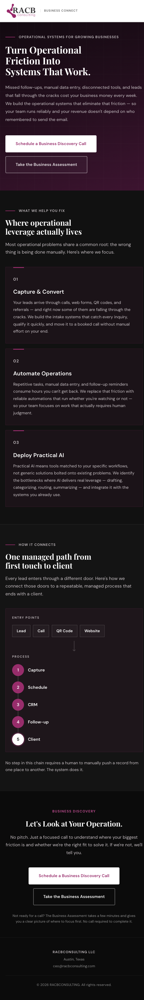
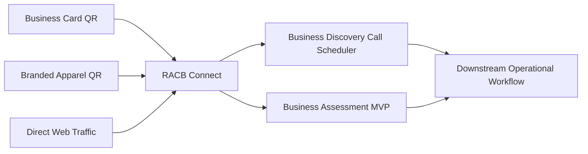
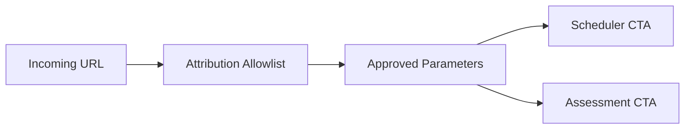

# RACB Connect

> **Production conversion gateway connecting physical and digital entry points to RACBCONSULTING discovery and assessment workflows through a deliberately lightweight, static-first architecture.**

| Attribute | Verified status |
|---|---|
| Evidence level | **Verified Implementation + Production Deployment + Operational Integration** |
| Implementation repository | Private |
| Application version | `1.0.0` |
| Primary capability | Automation & Integration |
| Secondary capability | Application Engineering |
| Framework | Astro 5 |
| Language / tooling | TypeScript + Astro |
| Production role | Primary RACBCONSULTING conversion gateway |
| Production hostname | `connect.racbconsulting.com` |
| Current production delivery | Static frontend on cPanel / hosting environment |
| Primary destination | Business Discovery Call scheduler |
| Secondary destination | RACBCONSULTING Business Assessment MVP |

## Overview

RACB Connect is the primary public conversion gateway for RACBCONSULTING.

Rather than duplicating scheduling, assessment, CRM, authentication, or database capabilities, Connect provides a focused entry layer that routes prospects into the appropriate downstream workflow. Physical touchpoints such as business cards and branded apparel use QR codes to send visitors into the same production gateway, while direct web traffic can enter through the production hostname.

The application is intentionally static-first. Its responsibility is to present the business value proposition, preserve approved attribution context, and move a visitor toward one of two explicit next actions:

1. schedule a Business Discovery Call;
2. enter the RACBCONSULTING Business Assessment.

This creates a small, independently deployable public surface while leaving stateful business processes to the systems designed to own them.

### Production conversion surface



*Production evidence for `connect.racbconsulting.com`, showing the live RACBCONSULTING entry surface, its Business Discovery Call and Business Assessment conversion paths, and the public explanation of the managed path from entry point through capture, scheduling, CRM, follow-up, and client progression.*

## The problem

A consulting business can create multiple acquisition touchpoints while still losing continuity between initial interest and the next operational step.

Typical failure modes include:

- physical marketing material pointing to disconnected destinations;
- multiple campaign URLs with inconsistent routing;
- duplicated scheduling or intake logic across landing pages;
- campaign attribution disappearing during handoff;
- public pages accumulating unnecessary backend complexity;
- lead entry surfaces becoming tightly coupled to CRM or assessment internals.

RACB Connect addresses that problem by providing one controlled conversion gateway in front of existing business systems.

**Entry point ≠ business workflow. Connect routes the visitor; downstream systems own the work.**

## Production conversion architecture



The public gateway does not claim ownership of the scheduler, assessment backend, CRM, or automation services. Those are separate systems with their own responsibilities and evidence boundaries.

## Deliberately small application boundary

The implementation repository explicitly defines RACB Connect as a static-first Astro application with no application database, authentication layer, CRM backend, scheduling backend, or analytics backend.

That boundary is architectural rather than accidental.

Connect is responsible for:

- public presentation;
- conversion-oriented calls to action;
- routing to approved downstream destinations;
- forwarding allowlisted attribution parameters;
- responsive branded interface behavior;
- static production delivery.

Connect is not responsible for:

- storing prospect records;
- authenticating consultants or prospects;
- creating appointments itself;
- implementing assessment logic;
- operating CRM records;
- running workflow automation.

This separation reduces the public application's runtime surface and avoids duplicating capabilities already owned elsewhere in the RACBCONSULTING system.

## Controlled attribution forwarding

RACB Connect contains a dedicated client-side attribution module.

Only the following parameters are currently allowlisted:

- `utm_source`;
- `utm_medium`;
- `utm_campaign`;
- `utm_content`;
- `source`;
- `campaign`;
- `promo`.

The module extracts only approved values from the incoming query string and appends them to marked downstream links using `URLSearchParams`.



Unknown query parameters are not intentionally propagated by this module.

The attribution layer is isolated from the presentation components so that future integrations can reuse the extraction and URL-building functions without depending on DOM-specific behavior.

## Conversion paths

The production interface exposes two explicit conversion paths.

### Primary path — Business Discovery Call

The primary call to action sends the visitor to the RACBCONSULTING scheduling surface for a Business Discovery Call.

### Secondary path — Business Assessment

The secondary call to action sends the visitor to the RACBCONSULTING MVP Business Assessment.

Both marked destinations receive the approved attribution parameters when those values were present at entry.

This allows Connect to remain a routing and presentation layer while the downstream applications retain ownership of their respective workflows.

## Physical-to-digital entry model

RACB Connect is also used as the destination for QR-based physical business touchpoints, including RACBCONSULTING business cards and branded apparel.

That implementation creates a simple acquisition pattern:

```text
Physical interaction
        ↓
       QR
        ↓
connect.racbconsulting.com
        ↓
Discovery Call or Business Assessment
```

### QR-enabled physical entry points


*Branded RACBCONSULTING apparel carrying a public “SCAN TO CONNECT” QR entry point, providing a physical path into the RACB Connect conversion gateway.*

[View the RACBCONSULTING business-card evidence (PDF)](../evidence/racb-connect/RACBCONSULTING_Business_Card.pdf)

*The business-card evidence includes a dedicated “SCAN TO START A CONVERSATION” QR surface, documenting a second physical acquisition touchpoint designed to enter the same digital conversion path.*

The existence of these physical entry points demonstrates operational integration of the production gateway. No conversion-rate or attribution-performance claim is made without corresponding measurement evidence.

## Application structure

The current implementation is a single-page Astro application assembled from focused components:

| Component | Responsibility |
|---|---|
| `Hero.astro` | Primary value proposition and conversion CTAs |
| `Capabilities.astro` | RACBCONSULTING capability presentation |
| `HowItConnects.astro` | Lead-to-client flow explanation |
| `FinalCta.astro` | Final conversion surface |
| `BaseLayout.astro` | HTML shell, metadata, canonical and social metadata |
| `attribution.ts` | Allowlisted attribution extraction and forwarding |
| `brand.css` | Shared RACBCONSULTING visual system |

The public assets also include the official RACBCONSULTING logo, favicon, robots directives, sitemap, and a static health document.

## Deployment design and production boundary

The repository contains a documented container deployment option using a multi-stage Docker build and `nginxinc/nginx-unprivileged` runtime on port `8080`, together with Docker Compose healthcheck configuration and a Caddy reverse-proxy deployment guide.

That repository configuration demonstrates a supported deployment design, but it is not presented here as the current production runtime.

The current production Connect frontend is delivered as a static build through the RACBCONSULTING cPanel hosting environment.

Keeping these claims separate is intentional:

- **implemented deployment capability:** Docker + unprivileged nginx + healthcheck + documented Caddy reverse proxy;
- **current production delivery:** static frontend hosted through cPanel.

## Build and quality controls

The repository defines explicit quality commands:

```text
npm run build
npm run check
```

The project documentation requires both the Astro production build and TypeScript/Astro checks to complete without errors before commit or deployment.

The implementation history also records corrective work around brand consistency and accessibility contrast, including removal of treatments that did not satisfy documented WCAG AA contrast targets.

This evidence supports an engineering process that includes implementation, review, correction, and production finalization rather than presentation-only design work.

## Verified technology profile

| Area | Implementation evidence |
|---|---|
| Framework | Astro 5 |
| Language | TypeScript / Astro components |
| Package management | npm + lockfile |
| Architecture | Static-first single-page application |
| Attribution | Client-side allowlist + `URLSearchParams` |
| Production build | Astro static build |
| Current production delivery | cPanel-hosted static frontend |
| Container option | Multi-stage Docker build |
| Container runtime | Unprivileged nginx image |
| Healthcheck design | Static `/health.json` endpoint |
| Reverse proxy design | Documented Caddy configuration |
| Search metadata | robots.txt + sitemap.xml + canonical metadata |
| Source control | Git / private GitHub implementation repository |

## Capabilities demonstrated

RACB Connect provides evidence of capability in:

- production landing-page engineering;
- conversion-path architecture;
- physical-to-digital workflow design;
- application-boundary design;
- static-first web architecture;
- Astro and TypeScript implementation;
- controlled attribution forwarding;
- URL and campaign parameter handling;
- integration with independent downstream business systems;
- responsive branded interface implementation;
- accessibility-oriented corrective review;
- static hosting deployment;
- containerized deployment design;
- healthcheck and reverse-proxy documentation;
- operational documentation and deployment separation.

## Deliberate boundaries

RACB Connect is not presented as a CRM, scheduler, assessment engine, analytics platform, marketing attribution platform, or stateful application backend.

The following are **not** claimed as native RACB Connect capabilities:

- prospect database storage;
- CRM record management;
- appointment creation or confirmation;
- assessment processing;
- authentication or authorization;
- server-side analytics;
- direct workflow automation execution;
- independent proof of QR conversion rates;
- independent proof of campaign performance;
- current production execution through the repository's optional Docker/Caddy deployment design.

## Evidence classification

**VERIFIED IMPLEMENTATION** — the private repository contains the Astro application, component architecture, attribution module, brand system, production build configuration, container deployment option, healthcheck design, and deployment documentation described here.

**PRODUCTION DEPLOYMENT** — the published production-surface evidence shows the operational RACBCONSULTING Connect gateway with both conversion destinations and the public managed-path model. The current application is delivered as a static frontend through the RACBCONSULTING cPanel hosting environment.

**OPERATIONAL INTEGRATION** — published physical evidence shows QR-enabled business-card and branded-apparel entry points feeding the Connect gateway, while the production interface routes visitors into the separate Business Discovery Call scheduler and RACBCONSULTING Business Assessment. Approved attribution parameters are preserved on marked downstream links.

No conversion-rate, campaign-performance, CRM-ownership, or backend-processing claim is made for Connect itself.

## Disclosure boundary

The implementation repository remains private. This Technical Evidence Center does not expose private infrastructure credentials, hosting configuration, internal campaign data, prospect information, analytics, CRM records, or proprietary downstream workflow details.

Published evidence is limited to sanitized architecture, implementation characteristics, production surfaces, and physical entry points appropriate for public technical review.

## Interested in this architecture?

RACB Connect is an internal RACBCONSULTING production application and conversion gateway, not an open-source application release.

Organizations exploring lightweight conversion gateways, physical-to-digital customer journeys, campaign-aware routing, business intake architecture, or integration of existing scheduling and assessment systems may contact RACBCONSULTING to discuss architecture, implementation, deployment, or operational integration.

---

**Rene Canete / RACBCONSULTING**  
Technical Evidence Center
