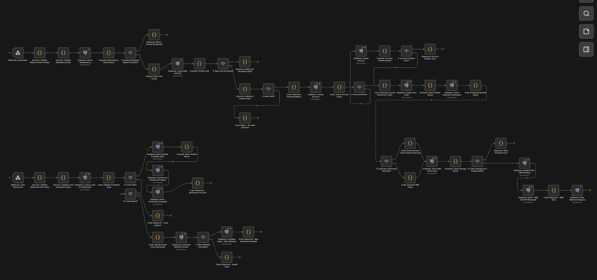
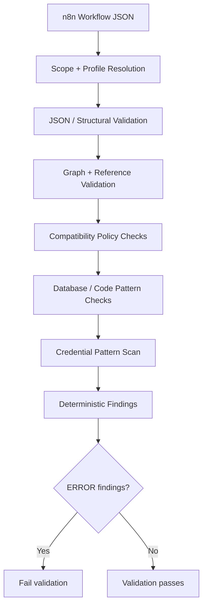
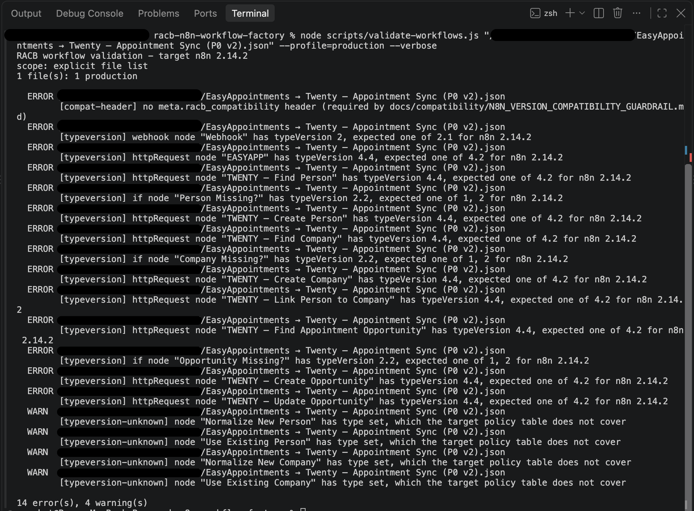
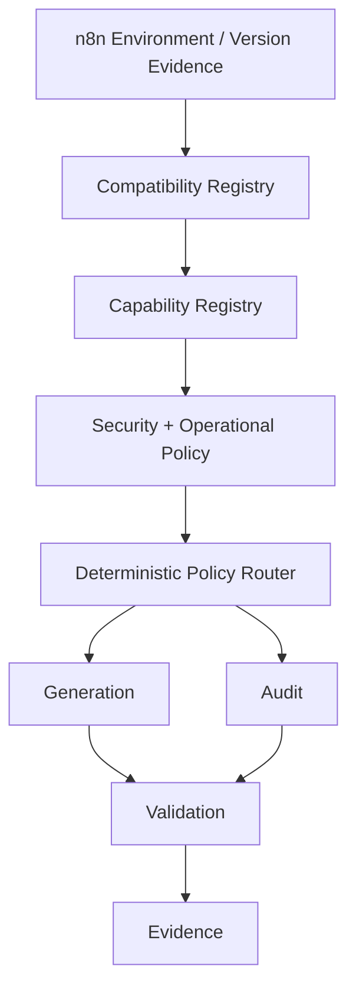
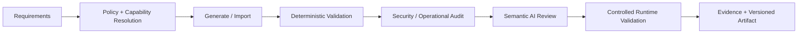

# RACB n8n Workflow Factory

> **Governed n8n workflow engineering with deterministic validation, compatibility controls, workflow evidence, and a security-oriented evolution path.**

| Attribute | Verified status |
|---|---|
| Evidence level | **Verified Implementation + Local Validation + Real-Workflow Benchmark** |
| Implementation repository | Private |
| Repository package version | `1.0.0` |
| Primary capability | Workflow Automation & Integration |
| Secondary capability | AI Operations & Governance |
| Target documented n8n environment | `2.14.2` |
| Current audit surface | Deterministic JSON / repository validation |
| External workflow validation | Supported from CLI |

## Overview

RACB n8n Workflow Factory is a proprietary RACBCONSULTING engineering system for controlled n8n workflow generation, validation, documentation, and versioning.

The project addresses a recurring automation-engineering problem: a workflow can import successfully or execute successfully while still containing structural defects, unsafe assumptions, weak failure handling, stale compatibility rules, or operational risks that are difficult to identify consistently through visual inspection alone.

Workflow Factory establishes a machine-checkable layer around workflow artifacts. The current implementation validates n8n JSON deterministically, applies profile-specific policy, checks graph and node integrity, evaluates selected compatibility and security conditions, and supports explicit validation of workflows outside the repository.

The implementation repository remains private. This page publishes sanitized architectural, validation, and benchmark evidence rather than proprietary source code or production credentials.

### Generated and remediated workflow evidence



*Sanitized n8n canvas evidence of the remediated RACB Lead Verification workflow. The workflow was produced through RACB Workflow Factory and subsequently hardened through deterministic validation and independent technical review. The artifact demonstrates validated workflow engineering; active production deployment is not implied.*

## The problem

Low-code automation does not eliminate engineering risk. As workflows grow across webhooks, APIs, databases, CRMs, messaging systems, and AI services, operational defects can become difficult to detect visually.

Representative risks include:

- malformed or structurally incomplete workflow exports;
- broken or disconnected graph paths;
- stale node compatibility assumptions;
- unsafe database parameter handling;
- accidental credential material in exported artifacts;
- weak webhook ingress controls;
- missing idempotency or replay protection;
- ambiguous identity matching across systems;
- partial remote writes after downstream failure;
- generated workflows being treated as validated merely because generation succeeded.

Workflow Factory is being developed around a stronger principle:

**Generated is not validated. Importable is not operationally safe. Compatibility, security, resilience, and evidence must remain distinguishable.**

## Current validation architecture



The validator runs offline. It does not require a live n8n server, database, or network connection for deterministic artifact analysis.

## Validation profiles

The current implementation distinguishes artifact intent rather than applying identical severity to every historical file.

| Profile | Purpose |
|---|---|
| `production` | Strict production-oriented validation |
| `migration` | Historical migration evidence; issues reported with reduced enforcement where appropriate |
| `archive` | Historical artifact preservation with primarily structural checks |
| `tests` | Test fixtures with intentionally relaxed compatibility/shape rules |
| `explicit` | Strict default for explicitly supplied external workflow files |

This separation allows historical evidence to remain preserved without silently redefining it as current production state.

## Deterministic checks currently demonstrated

The current validator includes checks covering areas such as:

- JSON parsing and required workflow structure;
- node-name and node-ID integrity;
- graph connections and missing node references;
- disconnected-node detection;
- reachability from workflow triggers;
- production workflow shape;
- target node `typeVersion` policy;
- unknown node types relative to the current compatibility table;
- PostgreSQL parameter-binding patterns;
- selected Code/Webhook compatibility patterns;
- selected compatibility metadata requirements;
- narrow detection of recognizable credential/secret patterns.

The secret scanner is intentionally described as narrow: absence of a finding is not presented as proof that an artifact contains no secret of any kind.

## Real-workflow benchmark

The current validator was exercised against a separate n8n workflow used in RACBCONSULTING operations: an Easy!Appointments-to-Twenty synchronization workflow originally created under time pressure for a live business funnel.

The external workflow was supplied directly to the validator under the strict production profile:

```bash
node scripts/validate-workflows.js \
"EasyAppointments → Twenty — Appointment Sync (P0 v2).json" \
--profile=production \
--verbose
```

### Audit execution evidence



*Sanitized CLI evidence of RACB Workflow Factory auditing an external operational n8n workflow under the production profile. The run reported 14 errors and 4 warnings and was used to benchmark both the validator's current deterministic capability and its known compatibility-policy limitations. Reported compatibility findings are not presented as proof that every mismatch represents a runtime failure.*

The deterministic run reported:

| Result | Count |
|---|---:|
| Errors | **14** |
| Warnings | **4** |

The findings were dominated by a missing RACB compatibility header, node `typeVersion` policy mismatches, and node types not covered by the current compatibility policy table.

This benchmark was useful for a second reason: comparison with an independent architectural review showed that the current validator does **not yet** detect several higher-level operational risks that require additional deterministic rules, semantic analysis, or runtime evidence.

Examples identified independently include webhook-authentication posture, response semantics, strong idempotency, replay protection, ambiguous identity matching, duplicate-creation risk, stale-event state overwrite, partial remote writes, and reconciliation behavior.

The benchmark therefore provides evidence of both current capability and current boundary. The project is not presented as already having a complete semantic security auditor.

## Compatibility-policy lesson

The same benchmark exposed an important governance issue: a hard-coded compatibility table can itself become stale.

A workflow currently operating successfully contained node type versions outside the Factory's committed target table. That disagreement is evidence that compatibility policy must be verified before a mismatch is automatically interpreted as an actual runtime incompatibility.

Accordingly, the architectural direction is to evolve from static compatibility constants toward version-aware, evidence-backed registries.



This registry/router architecture is **architectural direction**, not a claim that the complete capability already exists in the verified V1 implementation.

## Security-oriented workflow engineering

The longer-term design goal is not to generate arbitrary n8n JSON. It is to generate and evaluate workflows against context-appropriate engineering controls.

For example, an external webhook may require consideration of authentication, input validation, abuse controls, idempotency, controlled response semantics, error handling, and audit evidence. Those requirements should be derived from policy and capability rather than represented as a fixed sequence blindly inserted into every workflow.

The intended distinction is:

**Capability ≠ Policy ≠ Implementation.**

A target n8n environment may technically support a node or pattern without RACB policy recommending or authorizing that implementation for a particular risk context.

## AI adaptability direction

Workflow Factory also contains AI-oriented functionality whose future evolution is intended to avoid hard dependency on a single model or provider.

The design direction is to reuse the model-routing principles proven in RACB Agent Factory: model/provider capability representation, policy-controlled selection, adapters, bounded fallback, execution provenance, and deterministic verification wherever an AI-produced result can be checked mechanically.

The AI layer should assist semantic workflow review and generation without becoming the authority for facts that can be established deterministically.

This is a planned architectural evolution and is deliberately separated from verified current capability.

## Governed workflow lifecycle direction



The target lifecycle combines deterministic checks, semantic review, and optional runtime evidence rather than asking an LLM to self-certify a workflow it generated.

## Repository remediation and verification

A focused remediation sequence was completed on the private implementation repository before this public evidence page was prepared.

Verified work included:

- deterministic workflow validation wired into the repository test command;
- PostgreSQL placeholder/binding validation;
- graph-integrity validation;
- negative validation fixtures;
- production/migration/archive/test profile separation;
- documentation corrections to distinguish local validation from production validation;
- preservation of historical and experimental workflow artifacts rather than destructive cleanup;
- successful local build and validation after remediation.

The remediation did not establish external production certification. Runtime-dependent integration behavior remains classified separately where it has not been directly exercised.

## Verified technology profile

| Area | Implementation evidence |
|---|---|
| Primary runtime | Node.js |
| Custom node source | TypeScript |
| Build | TypeScript compiler |
| n8n integration | Custom n8n node package metadata |
| Current custom nodes | Node Configuration, Validation Expert, Workflow Patterns |
| Workflow validation | Deterministic Node.js CLI validator |
| Workflow artifacts | JSON |
| Database-oriented checks | PostgreSQL binding validation |
| AI/MCP dependency | n8n MCP integration present in repository package configuration |
| Version control | Git |
| Artifact classes | production / migration / archive / tests |

## Capabilities demonstrated

This project currently provides evidence of capability in:

- n8n workflow engineering;
- deterministic workflow artifact validation;
- graph and reference integrity analysis;
- compatibility-policy enforcement;
- database-query binding validation;
- narrow secret-pattern scanning;
- profile-aware governance of production and historical artifacts;
- validation of external workflow JSON from CLI;
- workflow versioning and evidence preservation;
- identification of limitations through real-workflow benchmarking;
- disciplined separation of verified implementation from proposed architecture.

## Deliberate boundaries

The current implementation should not be interpreted as a complete automated security certification system for arbitrary n8n workflows.

The verified deterministic validator can establish facts available from workflow artifacts and repository policy. Higher-level conclusions involving business semantics, remote-system behavior, authentication effectiveness, API side effects, concurrency, delivery guarantees, or runtime recovery may require heuristic analysis, AI-assisted semantic review, or controlled runtime validation.

Likewise, the current hard-coded compatibility policy is evidence of the target policy recorded by the repository, not proof that every node version outside that table is incompatible with a live n8n environment.

## Evidence classification

**VERIFIED IMPLEMENTATION** — TypeScript custom-node source, package metadata, deterministic validation tooling, workflow profiles, compatibility policy, graph checks, database-binding checks, selected security checks, and workflow artifacts are represented in the private implementation repository.

**LOCAL VALIDATION** — repository build/test and deterministic workflow-validation behavior were exercised during the remediation and review sequence.

**REAL-WORKFLOW BENCHMARK** — the validator was run against an external operational workflow and produced 14 errors and 4 warnings, exposing both current detection capability and gaps relative to independent architectural review.

**ARCHITECTURAL DIRECTION** — dynamic compatibility/capability registries, policy routing, deeper security/operational audit, model-independent AI routing, semantic review, runtime validation, and a future service interface are planned evolution and are not represented here as completed V1 capability.

## Product direction

Workflow Factory was conceived for two complementary uses:

1. **Internal RACBCONSULTING engineering** — generate, validate, audit, document, and version client/internal n8n automation with consistent controls.
2. **External service** — expose workflow audit and governed generation capabilities through a future web interface and usage-based or subscription service model.

The service interface is intentionally not the immediate engineering priority. Audit and generation engines must first establish useful, repeatable evidence before a commercial interface is placed around them.

## Disclosure boundary

The implementation repository is intentionally private. This Technical Evidence Center does not publish credentials, customer data, production authentication material, private infrastructure topology, internal endpoint details, proprietary prompts, or complete implementation source.

Architecture presented here is reconstructed and sanitized from verified project evidence.

## Interested in this architecture?

RACB n8n Workflow Factory is an internal RACBCONSULTING engineering system under continued development, not an open-source code release.

Organizations exploring governed workflow automation, n8n architecture, workflow auditing, secure automation patterns, or customized AI-assisted automation engineering may contact RACBCONSULTING to discuss architecture, implementation, or a guided technical review.

---

**Rene Canete / RACBCONSULTING**  
Technical Evidence Center
