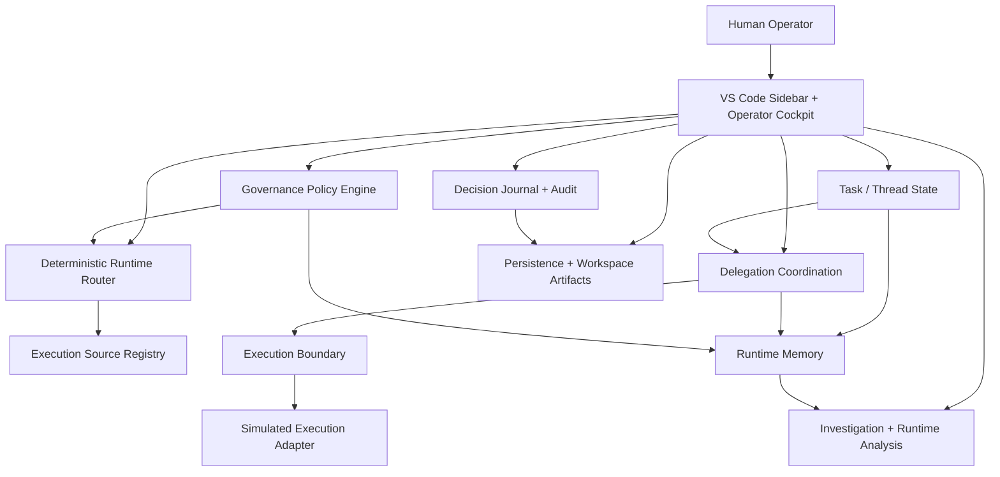
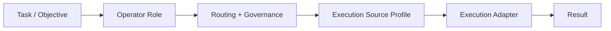
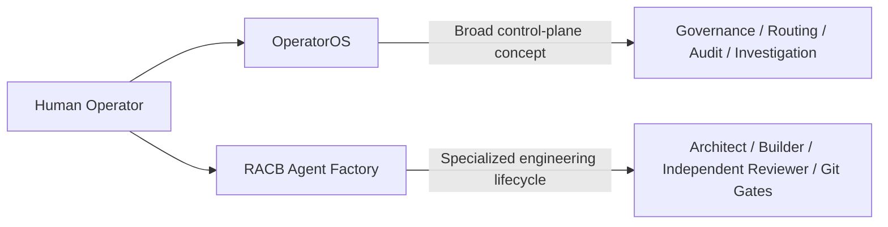

# RACB OperatorOS

> **Human-governed AI operations cockpit for task control, deterministic routing, governance, audit, persistence, and runtime investigation inside VS Code.**

| Attribute | Verified status |
|---|---|
| Evidence level | **Verified Implementation + Local Static Verification** |
| Implementation repository | Private |
| Audited checkpoint | `afcccc8` |
| Project maturity | **Functional Prototype** |
| Portfolio role | **Strong Supporting Project** |
| Primary capability | AI Operations & Governance |
| Secondary capability | AI & Agentic Systems |
| Product surface | TypeScript VS Code extension + webview Cockpit |
| External model/provider execution | **Simulated at this checkpoint** |

## Overview

RACB OperatorOS is a proprietary RACBCONSULTING prototype exploring a broader human-governed AI operations environment inside VS Code.

The project began from a practical orchestration problem: working across multiple AI systems can force the human operator to become the manual routing layer—transferring context, assigning work, comparing results, deciding what may proceed, and maintaining an operational record across disconnected tools.

OperatorOS explores a unified control plane for those responsibilities. Its implemented prototype combines operator and execution-source models, task lifecycle controls, deterministic routing recommendations, governance evaluation, persistence, decision records, audit views, and runtime investigation tooling.

The implementation repository remains private. This page publishes sanitized architectural evidence and explicitly preserves the project's current execution boundary: the control-plane implementation is substantial, but live external LLM/provider execution is not implemented at the audited checkpoint.

## The problem

Multi-model AI work creates an operational coordination problem beyond model capability alone:

- different operators and execution sources may be appropriate for different work;
- provider availability and cost can affect routing decisions;
- sensitive work may require local execution or additional review;
- task handoffs need context and lineage;
- recommendations should not automatically become authority;
- decisions and operational state need persistence;
- failures, contradictions, and governance pressure need observable evidence;
- UI labels or provider metadata should not be confused with verified execution.

OperatorOS was designed around a human-governed principle:

**Coordinate AI capability without surrendering operational authority or observability.**

## Control-plane architecture



At checkpoint `afcccc8`, the architecture above represents a real implemented control plane around a deliberately disclosed simulated execution boundary.

## Operator and execution-source separation

A notable architectural distinction in OperatorOS is that an **operator** is not the same thing as an **execution source**.

Operator profiles represent operational roles such as reasoning, research, or execution/orchestration. Execution-source profiles separately represent potential runtime mechanisms such as CLI, local, web, or API-based sources.



This separation is implemented in the prototype's model and routing structures. However, source profiles and metadata do **not** establish live provider integrations. At the audited checkpoint, only simulated execution is wired into the runtime.

## Deterministic routing model

The runtime router implements deterministic task-intent inference and source scoring using source metadata and policy-relevant characteristics.

Its evaluated dimensions include concepts such as:

- enabled and available source state;
- authentication requirements;
- execution type;
- priority;
- cost tier;
- inferred task intent;
- capability matching;
- provider/source characteristics.

The router can rank viable recommendations and identify fallback candidates. These are routing recommendations—not evidence of executed provider failover.

## Governance and human control

OperatorOS includes a deterministic governance policy engine with explicit verdict precedence and approval levels.

Implemented verdict handling includes:

```text
blocked
→ requires_local_execution
→ requires_safer_source
→ requires_manual_review
→ allowed_with_approval
→ allowed
```

The governance layer evaluates signals including sensitivity/data classification, source characteristics, authentication metadata, cost considerations, context, and local-versus-network execution preferences.

The implementation demonstrates policy evaluation and selected human-control flows, but governance is not presented as universally gating every dispatch/delegation path at this checkpoint.

Reviewed task handoffs provide a stronger implemented control: a handoff requires an eligible reviewed/completed parent task and carries inherited task context and lineage.

## Task lifecycle and delegation

The prototype implements task state, review, handoff, and thread-lineage logic alongside delegation planning and result-analysis structures.

Delegation includes implemented coordination constructs for:

- plans and assignments;
- result collection;
- result comparison;
- review summaries;
- delegation history.

The analytical and coordination code is real, while the underlying delegated outputs at this checkpoint are simulated/templated. Accordingly, delegation evidence is presented as prototype orchestration logic rather than live multi-provider execution.

## Decision governance and audit

Checkpoint `afcccc8` expanded OperatorOS with first-class decision and audit capabilities.

The implemented Decision Journal supports decision records, attachments, derived audit views, activity events, and workspace export.

Decision integrity uses SHA-256 to calculate a consistency hash over selected decision fields.

Safe interpretation:

**Decision Journal with SHA-256 hash-based consistency checks.**

The mechanism can detect relevant content changes when the stored hash has not also been replaced. It is not a digital signature, external trust anchor, chained ledger, cryptographically sealed journal, or immutable storage system.

## Runtime investigation

OperatorOS includes implemented analysis tooling over recorded prototype runtime state.

Available analysis surfaces include:

- anomaly detection;
- contradiction analysis;
- governance forensics;
- delegation tracing;
- investigation timelines;
- runtime heatmaps;
- snapshot comparison;
- investigation summaries.

These tools operate over stored activity, governance, delegation, snapshot, and operator-input history. Because provider execution remains simulated, calculated performance, consensus, quality, contradiction, duration, and related signals are **prototype observability**, not production provider telemetry.

Two additional models—incident records and investigation sessions—exist as foundation-level structures at this checkpoint but are not represented as operational incident-management or persisted investigation-session capabilities.

## Persistence and workspace evidence

The prototype implements persistence and workspace-oriented evidence mechanisms including:

- VS Code state-backed persistence;
- snapshots;
- serialization and validation;
- import/export infrastructure;
- workspace artifacts;
- command history;
- decision export;
- activity/audit-oriented records.

The Decision Journal is bounded rather than storage-level immutable or permanently append-only. Public evidence therefore describes these mechanisms according to their actual implementation boundaries.

## Execution boundary

The most important maturity boundary is explicit:

**External model/provider execution is simulated at checkpoint `afcccc8`.**

The extension registers a simulated execution adapter. Operator dispatch produces simulated results, and the delegation result path generates source-labeled prototype outputs rather than invoking Claude, OpenAI, Perplexity, Ollama, OpenRouter, or another external provider.

Consequently, execution-source entries, enabled/available metadata, provider names, routing scores, and Cockpit source labels must not be interpreted as proof of live connectivity.

This boundary is why OperatorOS is classified as a **Functional Prototype** rather than a validated production orchestration platform.

## Verified technology profile

| Area | Implementation evidence |
|---|---|
| Product form | VS Code extension |
| Core language | TypeScript |
| UI | VS Code activity-bar/sidebar + webview Cockpit |
| Task control | Task state, review, handoff, thread lineage |
| Routing | Deterministic intent inference + execution-source scoring |
| Governance | Deterministic policy evaluation + approval/verdict model |
| Persistence | VS Code state + snapshots + import/export/workspace artifacts |
| Audit | Decision Journal, attachments, audit timeline/trail |
| Integrity | SHA-256 hash-based decision consistency checks |
| Investigation | Anomaly, contradiction, governance, trace, heatmap, timeline, snapshot analysis |
| External execution | Simulated adapter at audited checkpoint |
| Static verification | TypeScript compilation completed successfully at audited checkpoint |

The audited package does not define an automated test suite or lint script. Successful TypeScript compilation is therefore reported as static verification, not as test coverage.

## Capabilities demonstrated

OperatorOS provides evidence of capability in:

- VS Code extension engineering;
- AI operations/control-plane architecture;
- separation of operator roles from execution sources;
- deterministic routing and source scoring;
- policy-oriented AI governance design;
- human review and controlled task handoffs;
- task/thread lineage;
- runtime state and persistence design;
- decision/audit workflow engineering;
- integrity-consistency checking;
- runtime investigation and observability tooling;
- designing explicit boundaries between control-plane capability and execution authority.

## Deliberate boundaries

OperatorOS is not presented as a finished autonomous AI platform.

At the audited checkpoint, public evidence does **not** imply:

- production-ready multi-LLM orchestration;
- live Claude, OpenAI, Perplexity, Ollama, or OpenRouter execution;
- autonomous end-to-end execution;
- validated provider failover;
- universal governance enforcement over every execution path;
- production telemetry or measured provider quality;
- operational incident-management workflows;
- cryptographically immutable or tamper-proof audit storage.

These boundaries are part of the evidence rather than defects hidden from it.

## Relationship to RACB Agent Factory

OperatorOS and RACB Agent Factory represent complementary architectural scopes, but no direct integration is claimed at this checkpoint.



OperatorOS explores the broader human-governed AI operations environment. RACB Agent Factory implements and validates a narrower governed engineering-delivery lifecycle with real agent execution and deterministic repository controls.

The projects therefore demonstrate an architectural progression from broad control-plane experimentation toward a specialized execution system with a much stronger validation boundary. This is a conceptual relationship, not evidence of an implemented OperatorOS ↔ Agent Factory integration.

## Evidence classification

**VERIFIED IMPLEMENTATION** — the private repository contains the VS Code product surface, task/state controls, deterministic routing, governance evaluation, persistence, command infrastructure, Decision Journal, audit tooling, and runtime investigation implementation described above.

**LOCAL STATIC VERIFICATION** — at checkpoint `afcccc8`, the TypeScript project compiled successfully with no diagnostics using already-present dependencies. No automated test suite or lint suite is claimed.

**FUNCTIONAL PROTOTYPE** — substantial control-plane functionality is implemented and integrated, while external model/provider execution remains simulated.

## Disclosure boundary

The implementation repository is intentionally private. Public evidence must exclude credentials, private workspace content, local filesystem paths, machine/user identifiers, sensitive runtime context, private infrastructure identifiers, and unnecessary proprietary implementation details.

Screenshots and exported artifacts require sanitization because runtime state may contain operator-entered instructions, task/context data, IDs, workspace information, decision text, or activity history.

Architecture presented here is reconstructed and sanitized from verified project evidence.

## Interested in this architecture?

RACB OperatorOS is an internal RACBCONSULTING prototype, not an open-source code release.

Organizations exploring human-governed AI operations, multi-model control-plane architecture, AI governance, operational observability, or customized agentic systems may contact RACBCONSULTING to discuss architecture, implementation, or technical review.

---

**Rene Canete / RACBCONSULTING**  
Technical Evidence Center
