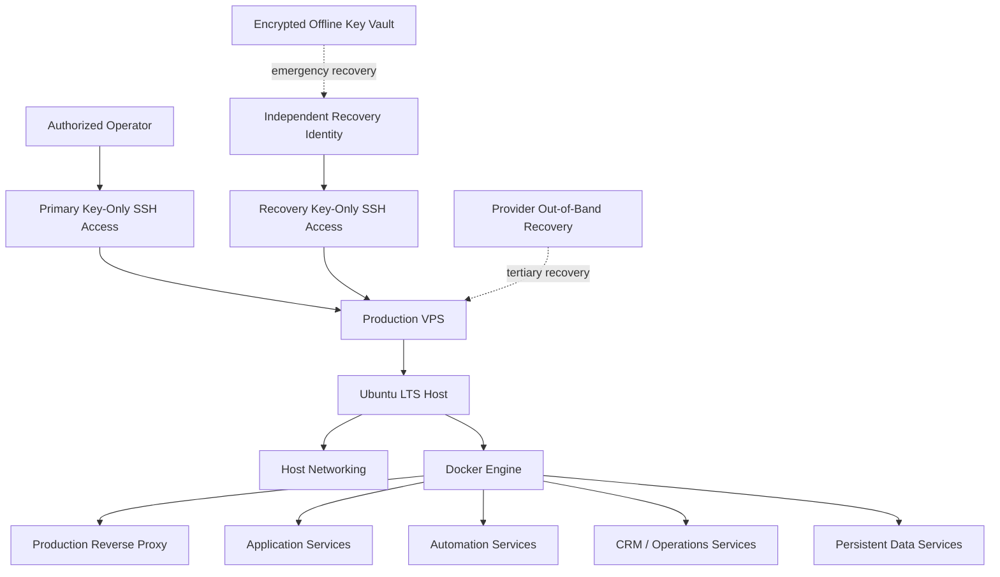

# RACB Production VPS Infrastructure

> **A production cloud infrastructure platform for securely publishing and operating RACBCONSULTING services with controlled administration, independent recovery access, containerized workloads, and evidence-based maintenance.**

| Attribute | Verified status |
|---|---|
| Evidence level | **Verified Runtime + Recovery Validation + Maintenance Validation** |
| Implementation repository | Private / operational infrastructure |
| Maturity | **Validated Production Infrastructure** |
| Portfolio role | Strong Supporting Project |
| Primary capability | Cloud Infrastructure & Operations |
| Secondary capability | Security, Recovery & Operational Governance |
| Host platform | Ubuntu 22.04 LTS |
| Infrastructure model | Docker-based production workloads + host-managed networking and SSH |

## Overview

The RACB Production VPS is the public-cloud infrastructure platform used to operate production RACBCONSULTING services and supporting automation workloads.

Unlike a simple application host, the platform is operated as a recoverable production system. Administrative access, independent emergency recovery, SSH hardening, container lifecycle behavior, operating-system maintenance, networking changes, and post-reboot service recovery have been directly exercised and validated.

This public portfolio page intentionally sanitizes operational details. Public IP addresses, administrative usernames, SSH public-key fingerprints, private key material, local filesystem paths, exact recovery aliases, internal routing details, credentials, environment files, and other security-sensitive artifacts are excluded.

## The problem

A production VPS can appear healthy while remaining operationally fragile.

Typical risks include:

- depending on one administrative identity or one workstation key;
- retaining password or direct root SSH access after emergency recovery;
- assuming a newly installed kernel will boot successfully;
- applying network-package changes without validating the active production path;
- treating running containers as proof that recovery after reboot works;
- disabling provider integration components merely because they report a failure;
- confusing recovery of access with identification of the original root cause;
- making security claims without testing the actual access paths.

The operating principle for this platform is:

**Implementation is not validation, and recovery is not root-cause analysis.**

## Platform architecture



The architecture separates normal administration, independent recovery, and provider-level out-of-band intervention rather than treating them as one access mechanism.

## Production workload surface

Current runtime validation confirms a multi-service Docker environment including:

- production reverse proxy;
- RACBCONSULTING backend services;
- scheduling services;
- workflow automation;
- CRM application services;
- PostgreSQL data services;
- Redis-backed application support;
- container administration tooling.

Application-specific credentials, exact public hostnames, container configuration, port mappings, and database connection details are intentionally omitted.

## Secure administrative access

The current validated SSH baseline uses public-key authentication for remote administration.

Verified controls include:

| Control | Validated state |
|---|---|
| Primary administrative access | Public key |
| Password SSH authentication | Disabled |
| Direct root SSH login | Disabled |
| SSH daemon configuration syntax | Validated |
| Effective SSH configuration | Validated |
| Fresh primary login after hardening | Successful |
| Fresh primary login after reboot | Successful |

Hardening was performed with configuration backup, syntax validation, effective-configuration inspection, daemon reload, and a fresh independent login test before the previous administrative session was treated as expendable.

## Independent recovery architecture

The VPS includes a separate recovery identity rather than relying on the primary administrative identity alone.

The recovery path uses:

- a dedicated operating-system account;
- an independent Ed25519 keypair;
- a passphrase-protected recovery private key;
- explicit administrative privilege through a separately validated sudo policy;
- password SSH disabled globally;
- direct root SSH disabled globally.

The recovery identity was tested through a fresh SSH session and validated through non-interactive privilege escalation to root.

This establishes a recovery path independent from the normal administrative SSH identity.

## Encrypted offline key vault

A removable encrypted offline vault was created as part of the recovery architecture.

The vault contains controlled backup material for selected RACB infrastructure access keys and a recovery runbook. Backup copies were compared against their source files, public-key fingerprints were independently verified, the encrypted media was ejected and reinserted, and the recovery path was then exercised directly from the removable media.

The end-to-end recovery drill validated the chain:

```text
Encrypted removable media
        ↓
Vault unlock
        ↓
Recovery private key
        ↓
Recovery SSH identity
        ↓
Administrative privilege
```

Vault encryption credentials and SSH-key passphrases are not stored in this public repository or documented here.

## Controlled operating-system maintenance

The platform underwent a staged Ubuntu maintenance cycle rather than an unbounded upgrade.

The process included:

1. inventory of the running kernel and pending packages;
2. confirmation that no packages were manually held;
3. simulated package upgrades before execution;
4. controlled installation of ordinary updates;
5. pre-reboot validation of SSH, Docker, containers, and boot artifacts;
6. confirmation that both current and newly installed kernel artifacts were available;
7. controlled reboot;
8. fresh SSH reconnection from the operator workstation;
9. confirmation that the new kernel was actually running;
10. post-reboot validation of Docker and application recovery.

The previous known-good kernel remains available as a rollback boundary rather than being immediately removed after the first successful boot.

A major Ubuntu release upgrade was deliberately kept outside this maintenance scope.

## Network package maintenance

Network-related packages were treated separately because a remote production server should not casually apply networking transitions while depending on that same network path for administration.

The validated sequence included:

- inspection of the active Netplan configuration;
- confirmation of the active network backend;
- successful generation of the existing Netplan configuration before upgrade;
- backup of the active cloud-generated Netplan source;
- installation of the supported Netplan package transition and dependencies;
- successful generation of the configuration after upgrade;
- direct comparison of the live interface and default route after package changes.

No unnecessary `netplan apply` was executed against an already healthy production network.

## Reboot and automatic recovery validation

The VPS was intentionally rebooted after the kernel and operating-system maintenance.

Post-reboot validation confirmed:

- the expected new kernel was running;
- SSH returned successfully;
- Docker returned successfully;
- host networking returned successfully;
- production containers restarted automatically;
- containers with configured health checks reached healthy state;
- no additional reboot was required after the completed package work.

This distinguishes configured restart behavior from demonstrated reboot recovery.

## Cloud-init hotplug investigation

After reboot, `cloud-init-hotplugd` reported a failed state associated with a Docker virtual Ethernet interface.

The failure was investigated rather than suppressed.

The investigation established that:

- the failing device was a Docker `veth`, not the production host interface;
- the host uses the Hetzner cloud-init datasource;
- the installed Hetzner hotplug rule is intended to route only provider-specific private-network interface events to the cloud-init hotplug hook;
- the Docker interface observed after the failure did not match that provider-specific MAC filter;
- an explicit udev test using an `add` action did not queue the cloud-init hotplug hook for the Docker interface;
- creation of a new isolated Docker network did not reproduce the cloud-init failure;
- the production provider hotplug mechanism was therefore left intact.

Only after investigation and a controlled reproduction attempt was the historical systemd failed-state marker cleared.

This case demonstrates an operational rule:

**A failed unit is a diagnostic signal, not automatic justification for disabling the component.**

The exact transient mechanism that caused the original Docker-interface event to reach the hook was not proven and is therefore not represented here as a confirmed root cause.

## Final maintenance validation

The closing validation established the following runtime state:

| Area | Verified result |
|---|---|
| Running kernel | Updated kernel successfully booted |
| Reboot requirement | None |
| Standard APT updates | None remaining |
| SSH | Active |
| Docker | Active |
| Host network backend | Active |
| Primary network interface | Up |
| Default route | Present |
| Production containers | Running |
| Health-checked production services | Healthy |
| Failed systemd units | 0 |

This is a point-in-time operational validation, not a guarantee of perpetual availability.

## Security-oriented design boundaries

The validated platform demonstrates several security and recovery practices without claiming complete security or external certification:

- key-only SSH administration;
- direct root SSH disabled;
- SSH password authentication disabled;
- separate primary and recovery identities;
- independent recovery key material;
- encrypted offline recovery media;
- tested emergency privilege path;
- configuration backup before SSH changes;
- validation before terminating known-good access;
- provider out-of-band recovery retained as a tertiary path;
- sensitive operational details excluded from the public portfolio.

A broader SSH hardening audit, application-level security review, disaster-recovery certification, high availability, and external penetration testing are outside the claims made by this project evidence.

## Operational governance demonstrated

This project provides evidence of a disciplined production-operations workflow:


Several decisions during the maintenance cycle deliberately favored evidence over convenience:

- an SSH access incident was separated into recovery and root-cause analysis;
- provider-enabled emergency access was removed after normal access was restored;
- networking packages were staged separately;
- the new kernel was not considered successful until a real reboot occurred;
- container restart policy was not considered validated until workloads recovered after reboot;
- a cloud-init failure was investigated instead of disabling the provider mechanism;
- the previous kernel was retained as rollback protection.

## Verified technology profile

| Area | Implementation evidence |
|---|---|
| Host platform | Ubuntu Server LTS |
| Container platform | Docker Engine |
| Reverse proxy | Caddy-based production proxy layer |
| Application runtime | Containerized RACBCONSULTING services |
| Workflow automation | n8n |
| CRM / operations | Twenty |
| Data services | PostgreSQL + Redis-backed services |
| Remote administration | OpenSSH / public-key authentication |
| Network configuration | Netplan + systemd-networkd |
| Cloud integration | Hetzner datasource / cloud-init |
| Operations interface | Portainer |
| Recovery model | Independent SSH identity + encrypted offline key vault + provider OOB |

## Capabilities demonstrated

This project provides evidence of capability in:

- Linux production server administration;
- Docker production operations;
- secure SSH administration and recovery design;
- cloud VPS lifecycle management;
- controlled operating-system patching;
- kernel upgrade and rollback discipline;
- remote network-maintenance risk management;
- Netplan and systemd-networkd operations;
- cloud-init and udev troubleshooting;
- Docker virtual-network troubleshooting;
- production reboot and recovery validation;
- recovery drills and offline key custody;
- incident root-cause discipline;
- evidence-based operational governance.

## Deliberate boundaries

The RACB Production VPS is not presented as a highly available cluster, externally certified security platform, or complete disaster-recovery implementation.

Current boundaries include:

- a single production VPS remains a single-host availability boundary;
- the previous kernel is retained for rollback but does not constitute host-level HA;
- application-specific recovery objectives are not claimed here;
- the cloud-init Docker-veth event was characterized and found non-reproducible, but its exact transient trigger was not proven;
- Ubuntu major-version migration remains a separately governed future activity;
- Ubuntu Pro / ESM Apps coverage is not represented as enabled or validated;
- application penetration testing is outside this infrastructure evidence;
- public evidence is intentionally less detailed than the private operational configuration.

## Evidence classification

**VERIFIED RUNTIME** — direct host observation confirms the operating-system, networking, SSH, Docker, and production workload state described at the validated maintenance checkpoint.

**RECOVERY VALIDATION** — primary administration, independent recovery SSH, administrative escalation, encrypted removable-media recovery, and provider out-of-band recovery boundaries were directly exercised or confirmed as part of the recovery architecture.

**MAINTENANCE VALIDATION** — package upgrades, network-package transition, controlled reboot, new-kernel boot, automatic workload recovery, and final system health were directly validated.

**INCIDENT INVESTIGATION** — the cloud-init hotplug failure was traced to a Docker virtual interface and tested against the active provider-specific udev filtering. The exact transient trigger remains explicitly unclaimed.

## Disclosure boundary

This public evidence intentionally excludes public IP addresses, administrative usernames, SSH key material and fingerprints, credentials, internal filesystem paths, environment files, exact routing internals, recovery aliases, provider support details, and other operationally sensitive information.

Architecture and operational behavior are presented in sanitized form from directly observed production evidence.

## Interested in this architecture?

The RACB Production VPS is internal RACBCONSULTING production infrastructure, not a public server image or infrastructure template.

Organizations working through cloud-server modernization, Docker-based service hosting, secure administrative access, recovery architecture, production maintenance, observability, or operational governance may contact RACBCONSULTING to discuss architecture, implementation, review, or modernization.

---

**Rene Canete / RACBCONSULTING**  
Technical Evidence Center
