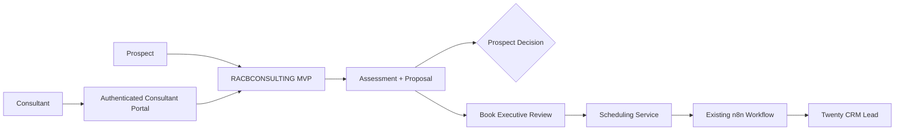
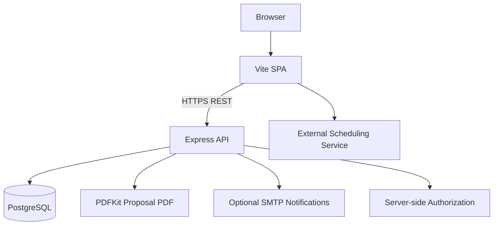
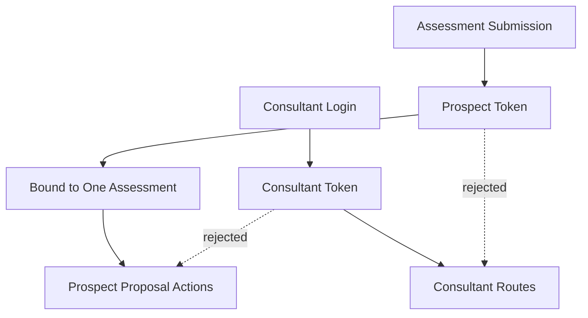

# RACBCONSULTING MVP

> **Production-deployed executive assessment and proposal platform with separated consultant/prospect authorization, assessment-bound workflow controls, deterministic proposal generation, and an operational scheduling-to-CRM handoff.**

| Attribute | Verified status |
|---|---|
| Evidence level | **Verified Implementation + Local Validation + Production Deployment Verification** |
| Implementation repository | Private |
| Primary capability | Application Engineering |
| Secondary capability | Workflow Automation & Integration |
| Deployment status | Production deployed |
| Frontend | Vite + vanilla JavaScript SPA |
| Backend | Node.js + Express |
| Persistence | PostgreSQL |
| Deployment model | Static frontend hosting + containerized backend behind HTTPS reverse proxy |

## Overview

RACBCONSULTING MVP is a production-deployed executive assessment and proposal application used to guide a prospect through a bilingual discovery workflow, persist assessment data, generate a deterministic proposal and PDF, capture controlled prospect decisions, and provide an authenticated consultant review surface.

The implementation repository remains private. This page publishes sanitized architecture, security and correctness controls, validation results, operational integration boundaries, and deployment evidence without exposing credentials, prospect data, private infrastructure details, or proprietary source code.

### Public assessment entry surface

*Sanitized production UI evidence showing the public assessment entry point and the visible separation between prospect interaction and private consultant access.*

## The problem

A business assessment application can appear operational while still containing important authorization, data-integrity, deployment, or workflow-boundary weaknesses.

Representative risks include:

- client-side secrets or privileged access controls;
- identifiers being treated as authorization;
- consultant and prospect authority becoming conflated;
- proposal actions being accepted without assessment-bound authorization;
- protected documents being retrievable without appropriate access control;
- deterministic business calculations being presented as if they were AI-generated findings;
- repository documentation overstating what external systems the application itself implements;
- successful implementation being mistaken for validated production behavior.

The application was hardened around a stricter operating principle:

**Implementation ≠ Validation. Identifier ≠ Credential. Capability ≠ Authority.**

## Business workflow

The scheduling-to-CRM automation is an existing operational integration outside the MVP repository:

**MVP → scheduling service → prospect books → existing n8n workflow → lead created in Twenty CRM.**

The MVP does **not** implement a direct Twenty CRM integration, and the repository does not contain the external n8n workflow. Application implementation and external operational integration are therefore treated as separate evidence classes.

## Application architecture

### Frontend responsibilities

- bilingual guided assessment workflow;
- proposal presentation;
- consultant-facing review views;
- deterministic calculations mirrored against backend rules;
- public build-time configuration for API and scheduling URLs;
- prospect authorization token retained in memory rather than browser storage.

### Backend responsibilities

- assessment persistence through PostgreSQL;
- request validation and mass-assignment controls;
- consultant authentication and signed session tokens;
- assessment-bound prospect authorization;
- proposal state transitions;
- deterministic server-side report generation;
- in-memory PDF generation;
- optional SMTP notifications;
- CORS, security headers, and rate limiting.

## Security and correctness controls

The production implementation includes several controls introduced to strengthen role separation, authorization, and data integrity:

- consultant and prospect authorization are separated by role and authority;
- consultant authentication is evaluated server-side;
- consultant sessions use signed tokens;
- prospect proposal tokens are separate from consultant tokens;
- prospect tokens are bound to a single assessment;
- prospect action endpoints require the assessment-bound prospect token;
- consultant sessions cannot record a decision as the prospect;
- proposal PDF access requires consultant or assessment-bound prospect authorization;
- assessment identifier knowledge alone does not authorize reads or workflow actions;
- request validation and allowed-field controls reduce unintended data mutation;
- calculation/report parity is covered by automated tests;
- production configuration separates public frontend settings from server-side secrets.

## Authorization model

The authorization design separates **capability** from **authority**.

### Consultant authentication boundary

*Sanitized production UI evidence showing the consultant authentication boundary before privileged internal assessment access.*

### Consultant authority

A consultant session can access consultant-only assessment review functionality and protected PDF retrieval. The consultant passcode is evaluated server-side and is not shipped to the frontend.

*Sanitized authenticated consultant portal using demo data, showing assessment search, lifecycle states, review controls, and internal management actions without exposing real prospect records.*

### Prospect authority

A successful assessment submission issues a short-lived signed token bound to that assessment. That token authorizes only the proposal workflow for the associated assessment.

The prospect token does not grant consultant access and cannot authorize another assessment.

The architecture does not treat possession of an assessment identifier as authorization.

## Proposal generation

The MVP proposal system is deterministic rather than LLM-generated.

Report and proposal content is produced from application templates, prospect-provided discovery data, and explicit arithmetic/planning rules. Values that cannot be calculated from supplied data are represented as not calculated rather than replaced with invented fallback metrics.

The implementation also distinguishes measured/calculated findings from proposed approaches, planning estimates, and potential outcomes.

This prevents presentation language from silently turning assumptions into verified business findings.

**Supporting evidence:** [Sanitized demo Executive Diagnostic & Strategic Advisory Proposal](../evidence/racbconsulting-mvp/RACBCONSULTING-Proposal-elite-flow-hvac-plumbing-0dda5e89.pdf)

The published proposal artifact uses demo data and demonstrates the complete deterministic output produced from an assessment without exposing real customer information.

## Scheduling and CRM integration boundary

The MVP provides a booking handoff to the production scheduling service.

The current user interface opens the scheduling service; the MVP itself does not create or confirm an appointment in the application database.

After an actual booking, a separate existing n8n workflow processes the scheduling event and creates the lead in Twenty CRM.

This boundary is intentionally documented because:

- the scheduling service is external to the MVP repository;
- the n8n workflow is not duplicated inside the MVP;
- Twenty CRM integration is not falsely attributed to application source code;
- operational automation can be evidenced without misrepresenting repository ownership.

## Validation evidence

*Sanitized validation evidence showing 66/66 backend tests passed, 27/27 frontend tests passed, zero failures, and a successful production frontend build.*

### Backend

**66 / 66 backend tests passed.**

The backend validation suite covers API behavior, authentication, authorization, request validation, calculations, email behavior, PDF behavior, and frontend/backend calculation parity using the repository's test harness.

### Frontend

**27 / 27 frontend tests passed.**

The frontend suite covers areas including escaping, configuration, calculations, and source-level guards.

### Build and end-to-end validation

The production frontend build and end-to-end validation completed successfully before deployment.

### Production verification

Selected production behavior was exercised successfully after deployment, including consultant authentication, frontend behavior, backend service operation, and authenticated assessment retrieval.

These checks establish deployment verification for the documented production implementation. They do not imply exhaustive production certification of every external dependency or every future runtime condition.

## Verified technology profile

| Area | Implementation evidence |
|---|---|
| Frontend | Vite + vanilla JavaScript SPA |
| Backend runtime | Node.js |
| API framework | Express |
| Database | PostgreSQL via `pg` |
| PDF generation | PDFKit |
| Email | Nodemailer / SMTP, optional |
| Authentication | Server-side passcode + HMAC-signed tokens |
| Prospect authorization | Short-lived signed assessment-bound token |
| HTTP controls | CORS, security headers, rate limiting, validation |
| Backend deployment | Docker container on RACBCONSULTING infrastructure |
| Reverse proxy / TLS | HTTPS reverse-proxy edge |
| Frontend deployment | Static hosting |
| Scheduling | External scheduling service |
| Downstream automation | Existing n8n workflow |
| CRM | Twenty CRM |
| Version control | Git / private GitHub implementation repository |

## Capabilities demonstrated

This project provides evidence of capability in:

- full-stack application engineering and remediation;
- REST API engineering;
- browser-to-API authorization design;
- role/authority separation;
- assessment-bound signed authorization tokens;
- PostgreSQL-backed application persistence;
- deterministic business-rule implementation;
- server-side PDF generation;
- security-oriented request validation;
- Dockerized backend deployment;
- static frontend deployment;
- automated backend/frontend validation;
- production verification after deployment;
- integration-boundary documentation across application, scheduler, n8n, and CRM systems.

## Deliberate boundaries

RACBCONSULTING MVP is not presented as a complete CRM, autonomous AI consulting system, or externally certified security platform.

The following are **not** claimed as current MVP capabilities:

- direct MVP-to-Twenty CRM integration;
- n8n workflow ownership inside the MVP repository;
- automatic appointment creation by the MVP itself;
- AI/LLM-generated proposal analysis;
- complete CI/CD automation;
- exhaustive production security certification;
- per-consultant identity/accounts;
- server-side token revocation;
- complete assessment lifecycle recovery for abandoned or incomplete prospect sessions.

## Evidence classification

**VERIFIED IMPLEMENTATION** — application source, authorization logic, validation, deterministic calculations, PDF generation, deployment configuration, and documentation are represented in the private implementation repository.

**LOCAL VALIDATION** — 66/66 backend tests, 27/27 frontend tests, frontend build, and end-to-end checks were completed successfully.

**PRODUCTION DEPLOYMENT VERIFICATION** — the production frontend and backend were deployed and selected authenticated application behavior was exercised successfully.

**OPERATIONAL INTEGRATION** — the production scheduling service feeds booked appointments into an existing n8n workflow that creates leads in Twenty CRM. This automation is intentionally documented as an external operational integration rather than source code contained in the MVP repository.

## Disclosure boundary

The implementation repository is intentionally private. This Technical Evidence Center does not publish production credentials, database passwords, consultant authentication material, prospect or customer PII, private assessment records, sensitive infrastructure details, private n8n credentials, CRM data, or complete proprietary implementation source.

Architecture presented here is reconstructed and sanitized from verified implementation and deployment evidence.

## Interested in this architecture?

RACBCONSULTING MVP is an internal RACBCONSULTING production application, not an open-source application release.

Organizations exploring secure business intake systems, assessment and proposal applications, workflow automation, CRM handoffs, application remediation, or customized operational platforms may contact RACBCONSULTING to discuss architecture, implementation, integration, or a guided technical review.

---

**Rene Canete / RACBCONSULTING**  
Technical Evidence Center
