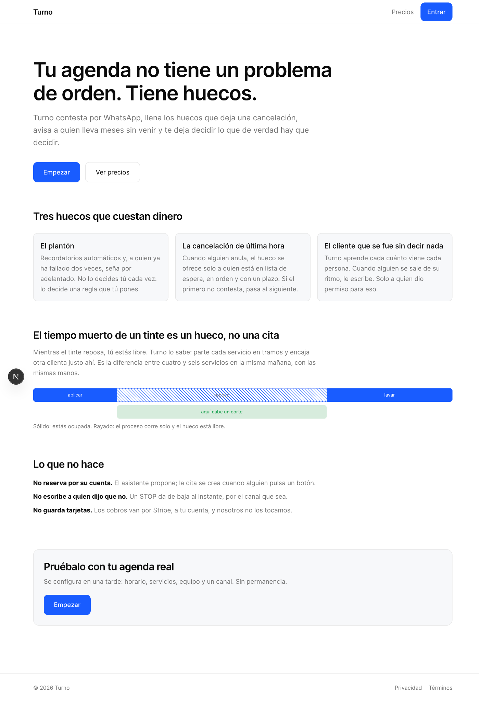
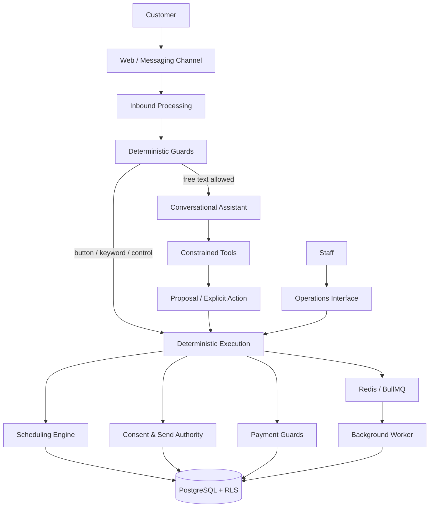
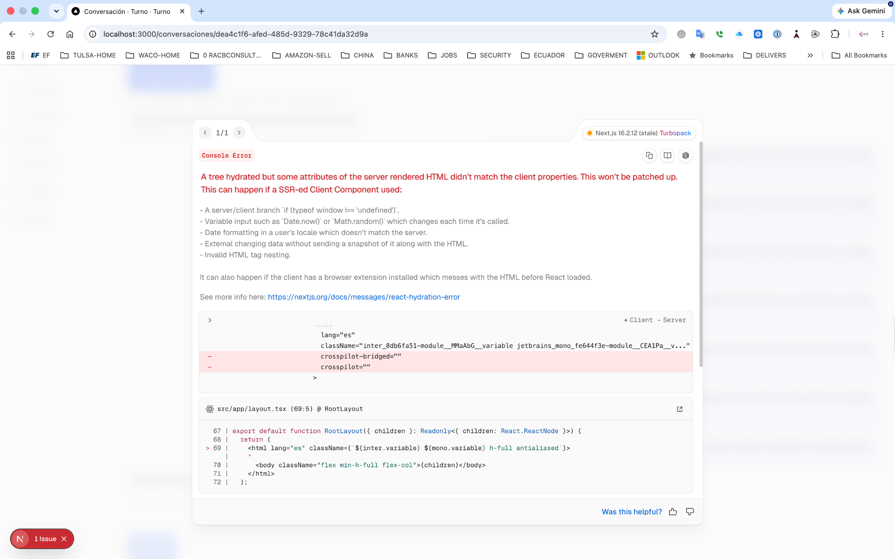
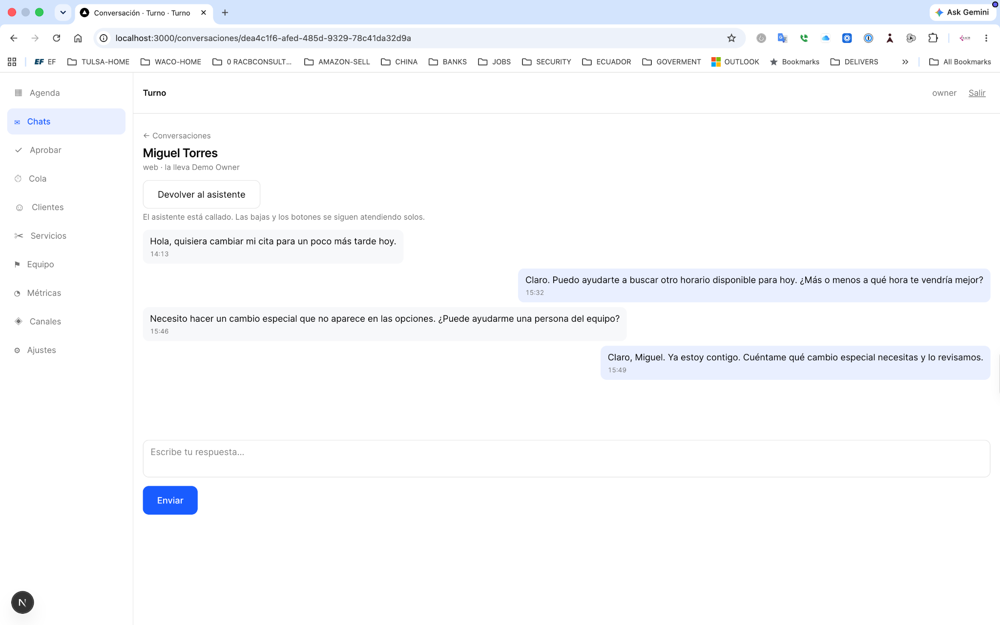
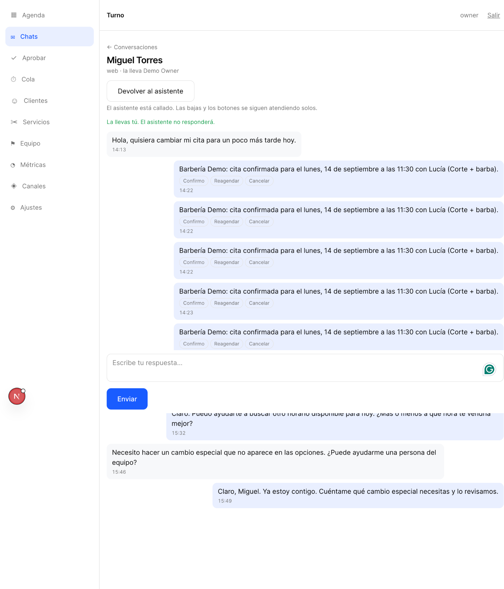
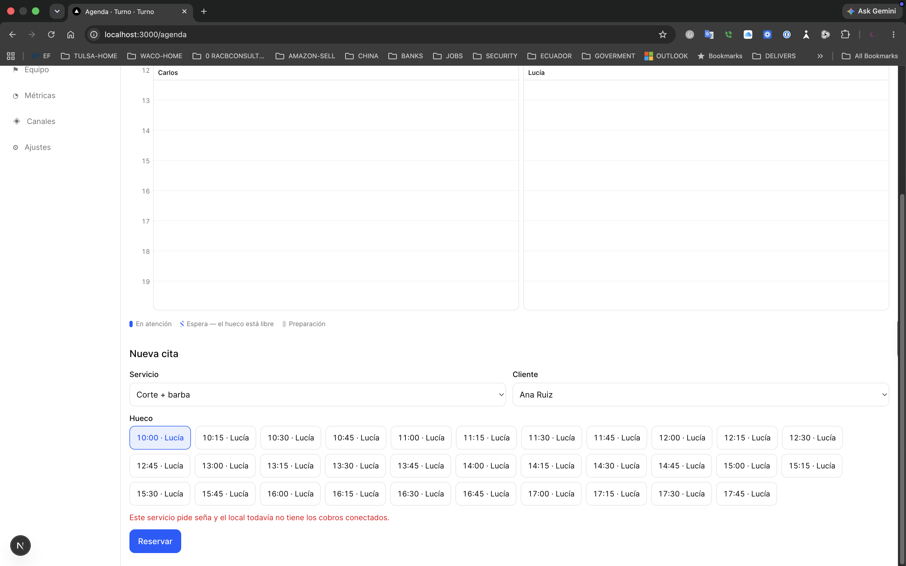
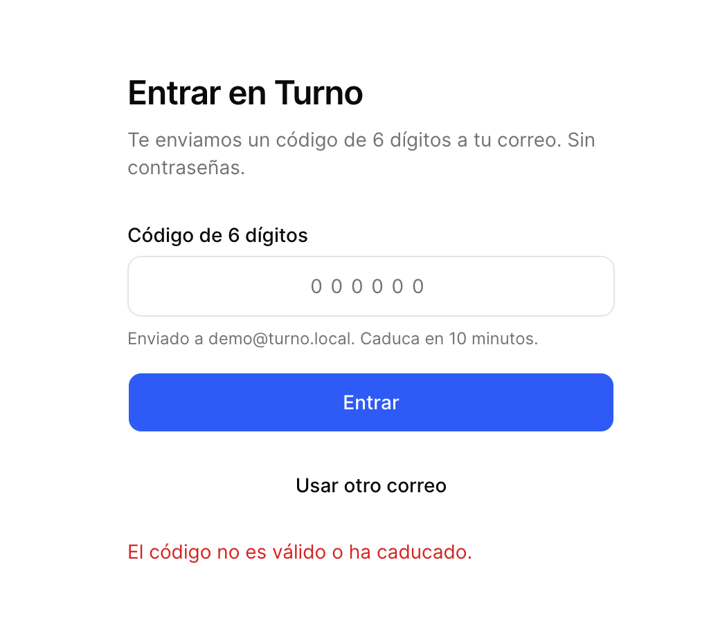

# Turno

> **Commissioned multi-tenant operational SaaS for appointment-based businesses — combining scheduling, conversational assistance, deterministic authority, consent, payments, tenant isolation, and background operations in one controlled system.**

| Attribute | Verified status |
|---|---|
| Evidence level | **Verified Implementation + Test-Backed Validation + Pre-Production Application Evidence** |
| Maturity | **Commissioned Project — Active Development / Pre-Production** |
| Project context | Private commissioned multi-tenant SaaS application |
| Implementation repository | Private |
| Application version | `0.1.0` |
| Primary capability | Application Engineering / Operational Systems |
| Secondary capabilities | Conversational AI / SaaS Architecture / Automation & Integration |
| Architecture | TypeScript monorepo: web application + worker + shared packages |
| Web application | Next.js / React |
| Data layer | PostgreSQL 16 + Drizzle ORM + migrations + Row-Level Security |
| Queue layer | Redis 7 + BullMQ |
| AI integration | Anthropic SDK |
| Planned deployment target | Railway web + worker + PostgreSQL + Redis |

## Overview

Turno is a commissioned multi-tenant SaaS application under active development and pre-production testing for a private client.

It is easy to describe Turno as an appointment application with an AI assistant. That description misses the engineering problem the system actually solves.

**Turno is an operational control system for appointment-based businesses.**

The agenda is only one visible surface of a larger state machine. Underneath it, Turno coordinates services, professionals, customers, availability, service segments, appointments, conversations, messaging consent, assistant/human authority, deposits, queues, reminders, and tenant boundaries. Those concerns do not merely coexist: the system has to decide which action is allowed, who may perform it, what must remain deterministic, what may be delegated to an AI model, and what should happen when a dependency or authority boundary is unavailable.

The implementation therefore treats correctness as an architectural concern rather than a UI convention.

*Pre-production application evidence. The product surface frames Turno around operational gaps in an appointment business and explicitly communicates authority, consent, and payment boundaries.*

## The operational problem

Appointment-based businesses lose capacity in ways a conventional calendar does not understand well. A cancellation creates recoverable capacity. A long service may contain periods during which the professional can perform other work. A customer may disappear for months. A conversation may begin with an assistant and require a person. A booking may require a deposit that cannot safely be accepted until payment capability exists.

At the same time, the system has to preserve invariants that are less visible but more important:

- two concurrent requests must not create an invalid double booking;
- tenant data must remain isolated even if an application query is wrong;
- a language model must not convert conversational confidence into database authority;
- a human takeover must silence the assistant without disabling mandatory consent handling;
- provider retries must not create duplicate operational actions;
- a required payment capability must fail closed rather than allow an invalid booking path;
- asynchronous reminders and outbound work must survive normal queue pressure;
- external credentials must remain server-side;
- degradation of the AI layer must not necessarily make the operational system unusable.

This leads to the core Turno design principle:

> **Conversation interprets intent. Deterministic systems own authority and state.**

## Turno as a controlled operating system

The important boundary is not between “AI” and “non-AI” features. It is between **interpretation and authority**.

The model can understand language, inspect allowed business context, check availability, and prepare proposals. State-changing actions remain constrained by application logic, confirmation flows, permissions, consent, and database rules.

## Scheduling is business-state modeling

Turno does not model every service as one indivisible block of occupied time.

Services can contain operational segments. A service such as a color treatment can include active work, passive processing time, and another active stage. That allows the scheduling model to represent capacity that a simple start/end calendar would incorrectly mark as unavailable.

This matters because utilization is not just a visual problem. The same availability model must remain valid across the management interface, public booking, and conversational paths, while database constraints protect against conflicting reservations under concurrency.

The pre-production interface makes that operational state directly manipulable by staff:

*Authenticated pre-production agenda showing multiple professionals and appointments after interactive rescheduling.*

The accompanying motion evidence demonstrates the interaction rather than only the resulting state:

https://github.com/user-attachments/assets/b02aed24-03bf-4f18-ae90-2130eeb9c95f

*Pre-production runtime interaction evidence showing an appointment being moved visually to another time slot.*

A staff operator can move an appointment visually to a different time slot. The significance is not the drag-and-drop gesture itself; it is that the UI is manipulating the same operational scheduling state governed by the application rather than maintaining a decorative calendar separate from business logic.

## AI assistance without AI ownership of the business

Turno's conversational architecture deliberately refuses to make the language model the final authority over operational state.

The agent is given constrained tools for capabilities such as listing services, checking availability, preparing bookings, preparing cancellations or reschedules, joining a waitlist, requesting identity verification, and escalating to a human. The booking and rescheduling tools prepare actions; they do not directly perform the final state change.

A conversational claim such as “I confirmed it” is therefore not equivalent to an authorized confirmation event.

The inbound pipeline resolves deterministic controls before free text reaches the model. Consent keywords, actionable button payloads, SMS numbered replies, and human-takeover state are handled in code. Only after those gates does free-form language enter the agent path.

This architecture produces a stronger invariant than prompt instructions alone:

> **The model is useful where interpretation is valuable, but it is structurally prevented from becoming the sole source of authority.**

## Human and assistant authority are explicit states

Turno does not treat human handoff as an informal instruction embedded in conversation history.

Conversation state records whether the assistant or a person currently owns the conversational turn. Before free text is sent to the model, the worker checks whether the assistant is allowed to reply. When a person has taken control, the assistant remains silent.

*Pre-production conversation state after staff takeover. The interface explicitly identifies human ownership and states that the assistant is silent.*

The handoff is visible to the operator and reversible. More importantly, it does not suspend system obligations. Opt-out handling and deterministic controls continue even while the assistant is silent.

**Human takeover ≠ compliance bypass.**

The broader conversation flow is also visible in the application evidence:

*Pre-production conversation evidence showing an assistant-to-human workflow and the staff reply surface. This image demonstrates the application state and handoff UX; it is not presented as proof of a live external AI-provider session.*

## Deterministic controls before the model

Several Turno controls intentionally live outside the prompt because “the model will usually obey” is not an operational guarantee.

The worker path establishes an order of authority before an agent call:

1. compliance-sensitive keywords are handled deterministically;
2. actionable button and numbered-message controls are resolved in code;
3. human takeover can prevent the model from seeing or answering the message;
4. tenant token budget can degrade the experience without crashing the workflow;
5. repeated unresolved agent turns can force escalation to a person.

At the configured conversation-call threshold, Turno stops assuming another model turn will solve the problem and hands the conversation to a human. Escalation is detected from the agent outcome/tool use rather than by searching generated text for a phrase.

The same philosophy applies to outbound communication: agent replies are persisted and sent through the normal queue and send-permission path instead of bypassing consent enforcement.

## Graceful degradation is part of the design

The AI layer is not treated as synonymous with application availability.

If the tenant's conversational token budget is exhausted, the agent path can degrade to a deterministic menu rather than turning the entire customer workflow into an error. If the system cannot safely load the required business context, it returns a bounded fallback instead of inventing schedule information.

That distinction matters operationally:

**AI capability can degrade while core business controls remain deterministic.**

## Consent and messaging are system responsibilities

Turno treats messaging consent as application state, not merely conversational etiquette.

Inbound processing records consent context, opt-out keywords are classified before the model, and outbound sends pass through permission controls. A human operator does not receive a privileged path around those rules simply because the response is manually initiated.

Provider retry behavior is also treated as a correctness problem. Inbound messages have durable idempotency protection so that a late duplicate provider event cannot silently become a second operational action.

For SMS, interactive choices degrade to numbered text responses. Those replies are resolved deterministically against the actionable choices that were actually sent rather than asking the model to infer what a bare “1” probably means.

This is a recurring Turno pattern: **channel limitations are adapted at the boundary instead of leaking ambiguity into business logic.**

## Payment capability fails closed

A booking workflow that requires a deposit should not silently continue when payment capability is unavailable.

Turno exposes that dependency directly in the pre-production application:

*Pre-production guard preventing a deposit-required booking when payment capability has not been connected for the business.*

This is more than an error message. It demonstrates the intended operational behavior: an unmet financial prerequisite blocks the dependent state transition instead of creating an appointment whose required payment state cannot be satisfied.

The repository also contains Stripe and Stripe Connect integration concepts, including separation between platform and connected-account webhook concerns. No live-payment claim is made from this evidence.

## Multi-tenant isolation is enforced below the UI

Turno is designed for multiple independent businesses, so tenant isolation cannot depend solely on every developer remembering to add a tenant filter to every query.

PostgreSQL Row-Level Security is part of the data boundary. Tenant-aware database access and dedicated role responsibilities are validated in security-focused repository suites.

That choice protects against a particularly dangerous class of SaaS failure: an application that appears correct in normal UI testing while an over-privileged database connection can still access another tenant's records.

The database role is therefore an operational invariant, not merely deployment configuration.

## Identity and staff access

The staff-facing application uses a passwordless email-code flow rather than a conventional stored-password UX.

*Pre-production passwordless authentication surface with six-digit code entry and bounded expiration messaging.*

Repository implementation adds controls behind that surface, including hashed one-time codes, expiration, attempt limits, single-use behavior, and generic invalid-code handling intended to avoid account-enumeration leakage.

The screenshot demonstrates the application boundary; the deeper controls are implementation evidence rather than claims inferred from the image.

## Background operations and queue-backed work

Turno separates interactive web requests from asynchronous operational work through Redis, BullMQ, and a dedicated worker application.

That architecture supports outbound messaging, reminders, agent processing, and other work that should not remain coupled to a browser request lifecycle. Queue reliability is treated explicitly in deployment design: Redis is expected to use `noeviction` behavior because silently evicting queued jobs can turn memory pressure into missing reminders or missing operational work without an obvious application failure.

Backup and restore-verification scripts also exist in the repository. They are implementation and deployment-design evidence, not a claim that production backup operations are currently running.

## One scheduling engine, multiple operational surfaces

Turno's management UI, public booking path, and conversational workflows are not intended to become independent scheduling systems with subtly different rules.

The public booking flow covers service selection, date/time selection, customer details, consent, and appointment creation without requiring an authenticated customer account. Conversational tools query the same business scheduling model. Staff operate on the resulting state through the management application.

That convergence is important because every duplicated scheduling engine creates another place for availability, deposits, cancellation rules, or staff constraints to diverge.

## Validation depth

The latest verified implementation checkpoint records **877 passing tests** across four distinct validation layers:

| Validation layer | Recorded result |
|---|---:|
| Unit tests | **388 passed** |
| Integration tests | **251 passed** |
| Security tests | **163 passed** |
| End-to-end tests | **75 passed** |
| **Total** | **877 passed** |

The repository also defines linting, TypeScript type checking, and production-build validation, with earlier full-system checkpoints recording successful runs.

The test organization itself reflects system architecture. Integration and security suites are deliberately serialized where packages share PostgreSQL and Redis infrastructure, avoiding false confidence from test parallelism that would corrupt shared validation state.

The security suite is particularly relevant to Turno because many of its most important claims are negative invariants: one tenant must not see another tenant, a model must not acquire unauthorized mutation capability, consent must not be bypassed, and identity controls must fail safely.

## Verified technology profile

| Area | Verified implementation |
|---|---|
| Monorepo | pnpm workspace + Turborepo |
| Runtime | Node.js 22+ |
| Language | TypeScript |
| Web | Next.js / React |
| Worker | Node background worker |
| Database | PostgreSQL 16 |
| ORM / migrations | Drizzle ORM |
| Tenant isolation | PostgreSQL Row-Level Security |
| Queue / cache | Redis 7 + BullMQ |
| AI | Anthropic SDK integration |
| Payments | Stripe + Stripe Connect concepts |
| Messaging | WhatsApp, Telegram, Twilio/SMS adapters and webhooks |
| Storage | Cloudflare R2 integration concepts |
| Email | Resend integration concepts |
| Observability | Sentry integration concepts |
| Deployment configuration | Railway |
| Validation | Unit + integration + security + E2E + lint + typecheck + build |

## What this project demonstrates

Turno provides evidence of engineering capability across several layers at once:

- **Operational modeling** — translating real appointment-business behavior into explicit system state rather than treating the product as CRUD around a calendar.
- **Multi-tenant SaaS architecture** — tenant-aware application paths backed by PostgreSQL RLS and role boundaries.
- **Concurrency-aware scheduling** — availability and conflict protection designed for state correctness, not only UI convenience.
- **Human/AI authority design** — explicit ownership of conversation state, constrained agent tools, deterministic execution, and reversible handoff.
- **AI safety by architecture** — critical controls enforced before or outside the model instead of depending on prompt obedience.
- **Messaging compliance engineering** — consent, opt-out, send authorization, channel-specific controls, and durable idempotency.
- **Failure-safe product behavior** — deposit prerequisites and other unavailable capabilities block dependent operations instead of producing inconsistent state.
- **Graceful AI degradation** — conversational capability can fall back while deterministic business paths remain available.
- **Queue-backed operations** — asynchronous work separated from request/response paths with explicit reliability assumptions.
- **Application security** — passwordless identity controls, credential boundaries, tenant isolation, and dedicated security validation.
- **Full-stack product engineering** — authenticated operations UI, public customer paths, workers, database design, integrations, and deployment planning in one coherent system.
- **Validation discipline** — 877 recorded passing tests across unit, integration, security, and E2E layers at the latest verified checkpoint.

## Deployment design — not deployment evidence

Turno contains a Railway deployment design with separate web, worker, PostgreSQL, and Redis services, plus intended domain routing, provider webhooks, database bootstrap roles, migration sequencing, environment configuration, backup verification, and post-deployment checks.

The same documentation identifies checks that require real external accounts and a live environment.

Therefore:

> **Deployment configuration ≠ production deployment.**

Turno is not presented here as a production-running SaaS.

## Evidence map

| Evidence artifact | What it supports | Classification |
|---|---|---|
| `turno-product-overview.png` | Product model, scheduling concept, visible operating boundaries | Pre-production application evidence |
| `turno-scheduling-reschedule.png` | Multi-professional agenda and rescheduled appointment state | Pre-production application evidence |
| `turno-visual-scheduled.mp4` | Direct visual manipulation of scheduling state | Pre-production runtime interaction evidence |
| `turno-human-takeover.png` | Explicit human ownership and assistant-silent state | Pre-production application evidence |
| `turno-conversation-handoff.png` | Conversation/handoff workflow surface | Pre-production application evidence |
| `turno-deposit-guard.png` | Deposit-required booking blocked without payment capability | Pre-production guardrail evidence |
| `turno-passwordless-auth.png` | Passwordless staff authentication UX | Pre-production application evidence |
| Private implementation repository | Architecture, deterministic controls, RLS, queues, integrations, operational scripts | Verified implementation |
| Repository validation checkpoints | Unit, integration, security, and E2E results | Test-backed validation |

## Deliberate boundaries

Turno is a commissioned project under active development and pre-production validation. The public evidence is intentionally strong about what has been verified and equally explicit about what has not.

This evidence set does **not** claim:

- active Railway production deployment;
- live public operation;
- real customer tenants in production;
- live external-provider validation for WhatsApp, Telegram, Twilio, Stripe, R2, Resend, or Sentry;
- live financial processing;
- production backup execution;
- production uptime, scale, conversion, revenue, or customer metrics;
- exhaustive security certification.

The screenshots and video are local/pre-production application evidence. Demo identities shown in the interface are test/demo data and are not presented as real customer activity.

## Evidence classification

**VERIFIED IMPLEMENTATION** — the private repository contains the web application, worker, shared packages, database migrations, RLS controls, scheduling logic, queue architecture, constrained conversational tools, messaging adapters, consent enforcement, public booking path, payment integration code, deployment configuration, and operational scripts described here.

**TEST-BACKED VALIDATION** — the latest verified checkpoint records 388 unit, 251 integration, 163 security, and 75 end-to-end tests passing: **877 tests in total**. Earlier checkpoints also record successful lint, typecheck, and production-build validation.

**PRE-PRODUCTION APPLICATION EVIDENCE** — sanitized screenshots and motion evidence demonstrate the implemented application surface, interactive scheduling, human takeover state, payment guard, and passwordless access in a local/pre-production environment.

**COMMISSIONED / PRE-PRODUCTION** — Turno is being developed for a private commissioning client. Client identity and commercial terms remain private. Deployment configuration exists, while live external-service and production-environment verification remain outside the current evidence boundary.

## Disclosure boundary

The implementation repository remains private. The commissioning client is not identified, and no private commercial terms are disclosed.

The Technical Evidence Center does not expose credentials, encryption material, provider secrets, database connection strings, real tenant/customer data, or proprietary implementation details unnecessary for technical review. Public artifacts are sanitized and intentionally limited to evidence required to support the technical claims made here.

## Interested in this architecture?

Turno is a private commissioned RACB application-engineering project, not an open-source product release or a claim of a currently deployed commercial service.

The architecture demonstrates how appointment-driven operations can be modeled as a controlled system in which scheduling, conversations, AI assistance, human authority, consent, payments, tenant isolation, and asynchronous work share explicit operational boundaries.

Organizations building scheduling-intensive SaaS, human-in-the-loop AI systems, multi-tenant operational platforms, conversational workflows, or systems where generated intent must remain separated from deterministic authority may contact RACBCONSULTING to discuss architecture, engineering, validation, or adaptation to related operational problems.

---

**Rene Canete / RACBCONSULTING**  
Technical Evidence Center
