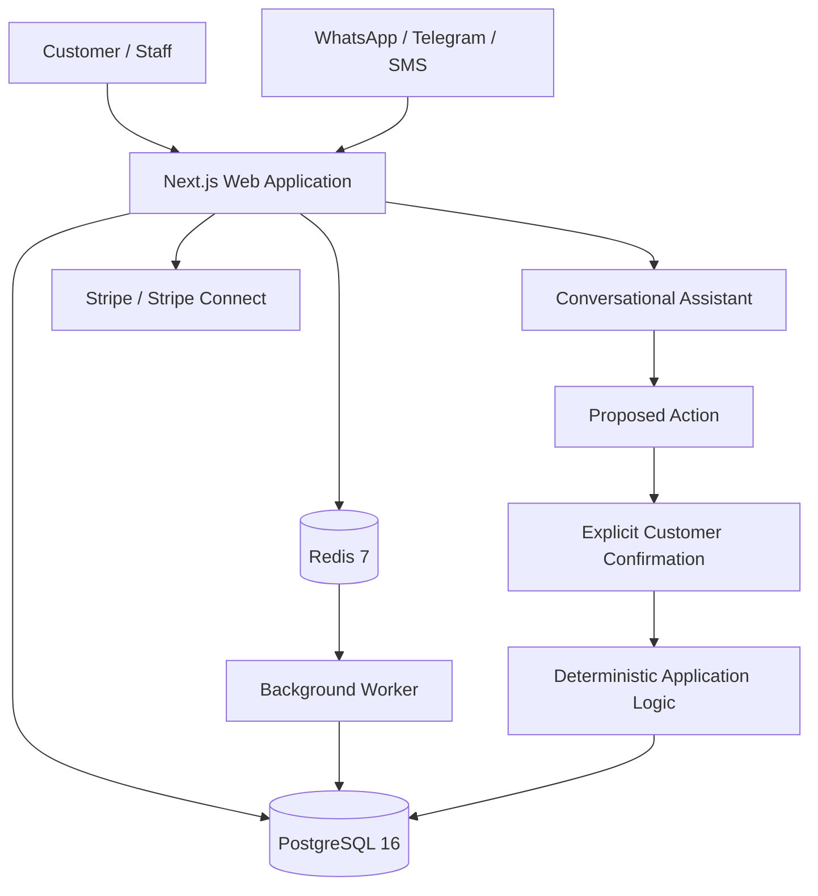

# Turno

> **Multi-tenant appointment platform for salons and barbershops combining deterministic scheduling, tenant isolation, conversational assistance, messaging compliance, payments, and background operations.**

| Attribute | Verified status |
|---|---|
| Evidence level | **Verified Implementation + Test-Backed Validation** |
| Maturity | **Substantial Active Development — Not Deployed** |
| Implementation repository | Private |
| Application version | `0.1.0` |
| Primary capability | Application Engineering |
| Secondary capability | Conversational AI |
| Architecture | TypeScript monorepo: web application + worker + shared packages |
| Web application | Next.js / React |
| Data layer | PostgreSQL 16 + Drizzle ORM + migrations + Row-Level Security |
| Queue layer | Redis 7 + BullMQ |
| AI integration | Anthropic SDK |
| Planned deployment target | Railway web + worker + PostgreSQL + Redis |

## Overview

Turno is a multi-tenant appointment-management SaaS designed for salons and barbershops.

The implementation goes beyond a calendar interface. It combines appointment scheduling, customer management, public booking, multi-channel conversations, human handoff, payments, background jobs, tenant-aware database controls, messaging consent, and a constrained conversational assistant inside one application architecture.

The project is intentionally classified as **implemented and extensively validated, but not deployed**. Repository deployment documentation explicitly separates what is already built from the external-service and production checks that still require real accounts and a live environment.

## The problem

Appointment businesses operate across several systems that can fail independently: calendars, customer records, reminders, messaging channels, deposits, staff access, and customer consent.

The harder engineering problem is not simply accepting a booking. It is preserving correct business behavior when these concerns interact.

Examples include:

- preventing double booking under concurrent requests;
- representing services that contain productive and non-blocking time;
- isolating data between independent businesses;
- preventing an AI assistant from directly mutating appointment state;
- preserving opt-out rights even when a human operator takes over a conversation;
- ensuring queued reminders are not silently evicted;
- handling payment events across platform and connected-account webhook boundaries;
- preventing provider credentials from leaking back into the management UI.

Turno addresses those problems through explicit application, database, queue, and authorization boundaries rather than relying on conversational behavior or UI convention alone.

**Conversation can propose an action. Deterministic application logic owns the state change.**

## System architecture

The repository is organized as a TypeScript monorepo with separate `web` and `worker` applications plus shared workspace packages.

## Multi-tenant data isolation

Tenant isolation is enforced at the database layer rather than being left only to application queries.

The implementation uses PostgreSQL Row-Level Security across tenant-scoped data and separates database responsibilities through dedicated roles. Repository validation has exercised tenant-aware database behavior, including RLS-sensitive paths and security-focused suites.

This is important because a multi-tenant application can appear correct at the UI layer while still exposing cross-tenant data if the database connection operates with excessive authority.

The deployment procedure therefore treats the application database role as a production invariant: using the wrong role can bypass the intended RLS boundary without producing an obvious application failure.

## Scheduling as business-state modeling

Turno models appointments as operational scheduling state rather than as a single naive start/end interval.

The implementation supports service segments so that non-blocking service time does not unnecessarily occupy a professional's entire availability window. Database constraints are used to prevent conflicting reservations rather than relying only on a pre-insert availability check.

This design addresses both utilization and concurrency: availability must remain correct even when multiple booking attempts occur close together.

## Conversational assistant with deterministic authority

Turno includes an AI-assisted conversational path, but the language model is not given unrestricted appointment authority.

The architecture separates:

1. conversation and intent handling;
2. proposed actions;
3. explicit customer confirmation;
4. deterministic execution by application code.

The implementation history documents this principle directly: the model proposes; deterministic code executes after the customer confirms the action.

That boundary reduces the risk of treating generated language as authorization to modify business state.

## Multi-channel conversation handling

The application contains management and adapter logic for WhatsApp, Telegram, and SMS concepts.

Verified implementation work includes:

- channel-management surfaces;
- provider webhook routing;
- encrypted provider credentials by business location;
- prevention of credential values being returned to the browser;
- unified conversation inbox behavior;
- human takeover and return-to-assistant controls;
- manual reply restrictions while the assistant owns the conversation;
- continued processing of compliance-sensitive keywords and controls during human takeover.

A recent corrective implementation also closed the SMS confirmation loop by resolving numbered SMS replies against the actionable choices contained in the outgoing message, with expiration and exact-match constraints.

## Human handoff without disabling compliance

Turno distinguishes **assistant authority** from **system obligations**.

When a human takes control of a conversation, the assistant is silenced for ordinary responses. The system itself, however, continues to process controls that must remain available independently of the assistant, including messaging opt-out behavior.

Manual outbound replies also pass through the application's send-permission control rather than bypassing it simply because a human initiated the message.

This creates an important operational rule:

**Human takeover ≠ compliance bypass.**

## Public booking path

The repository includes a public booking flow for the end customer.

The implemented path covers service selection, date/time selection, customer details, explicit consent, and creation of the appointment in the business schedule without requiring an authenticated customer session.

The public flow reuses the same availability model used by the management application and conversational assistant rather than implementing a separate scheduling engine.

## Payments and deposits

Turno includes Stripe integration concepts for subscriptions and Stripe Connect for business-level payment flows.

The documented design uses direct connected-account charges for appointment deposits so that the funds are not modeled as passing through Turno itself.

The deployment documentation also distinguishes the platform Stripe webhook registration from the Connect webhook registration. This matters because a successful payment alone is insufficient if the application never receives the event needed to reconcile the deposit state.

No live-payment or production financial-processing claim is made in this case study.

## Background jobs and reliability controls

The worker architecture uses Redis and queue-backed background processing for asynchronous operational work.

The deployment design requires Redis `noeviction` behavior because silent eviction of queued jobs could otherwise cause reminders or other work to disappear under memory pressure without an application-level failure.

Turno also contains backup and restore-verification scripts, with repository documentation describing a daily database dump and a scheduled restore check against a disposable database as part of the intended production operating model.

These are implemented operational controls, but they are not presented as production-running evidence because Turno has not been deployed.

## Validation evidence

The repository defines separate validation commands for:

- unit tests;
- integration tests;
- security tests;
- end-to-end tests;
- linting;
- TypeScript type checking;
- production build.

The latest verified implementation checkpoint records:

| Validation layer | Recorded result |
|---|---:|
| Unit tests | **388 passed** |
| Integration tests | **251 passed** |
| Security tests | **163 passed** |
| End-to-end tests | **75 passed** |

Earlier full-system checkpoints also record successful lint, typecheck, and production build validation.

The repository deliberately serializes integration and security execution across packages because the suites share one PostgreSQL and one Redis instance. That is an engineering constraint of the validation environment, not a cosmetic test-runner setting.

## Deployment design — not deployment evidence

Turno contains a detailed Railway deployment design consisting of four services in one project:

| Service | Planned role |
|---|---|
| `web` | Next.js application |
| `worker` | Queue-processing worker |
| `postgres` | PostgreSQL 16 |
| `redis` | Redis 7 |

The documentation also defines intended `turno.app` and wildcard subdomain routing, provider webhooks, database bootstrap roles, migration sequencing, production environment variables, backup verification, and post-deployment checks.

However, the same deployment document explicitly identifies checks that require real external accounts and a live environment.

Therefore:

**Deployment configuration ≠ production deployment.**

This case study does not claim that Turno is currently running in production.

## Verified technology profile

| Area | Verified implementation |
|---|---|
| Monorepo | pnpm workspace + Turborepo |
| Runtime | Node.js 22+ |
| Language | TypeScript |
| Web | Next.js / React |
| Worker | Node background worker |
| Database | PostgreSQL 16 |
| ORM / migrations | Drizzle ORM |
| Tenant isolation | PostgreSQL Row-Level Security |
| Queue / cache | Redis 7 + BullMQ |
| AI | Anthropic SDK integration |
| Payments | Stripe + Stripe Connect concepts |
| Messaging | WhatsApp, Telegram, Twilio/SMS adapters and webhooks |
| Storage | Cloudflare R2 integration concepts |
| Email | Resend integration concepts |
| Observability | Sentry integration concepts |
| Deployment configuration | Railway |
| Validation | Unit + integration + security + E2E + lint + typecheck + build |

## Capabilities demonstrated

Turno provides evidence of capability in:

- multi-tenant SaaS architecture;
- TypeScript monorepo engineering;
- Next.js application development;
- PostgreSQL schema and migration design;
- database-level tenant isolation with RLS;
- concurrency-aware appointment scheduling;
- background-worker and queue architecture;
- AI-assisted conversational workflow design;
- deterministic authority boundaries around LLM actions;
- multi-channel messaging integration;
- human/assistant handoff design;
- messaging consent and opt-out enforcement;
- public booking workflow engineering;
- payment and webhook architecture;
- security-focused testing;
- integration and end-to-end validation;
- deployment and recovery planning.

## Deliberate boundaries

Turno is not presented as a production-deployed SaaS or as proof of live external-provider operation.

The following are not claimed by this evidence set:

- active Railway production deployment;
- live `turno.app` operation;
- real salon or barbershop tenants in production;
- live WhatsApp, Telegram, Twilio, Stripe, R2, Resend, or Sentry provider validation;
- live payment processing;
- live backup execution in production;
- production uptime, scale, conversion, revenue, or customer metrics;
- exhaustive security certification.

## Evidence classification

**VERIFIED IMPLEMENTATION** — the private repository contains the web application, worker, shared packages, database migrations, RLS controls, queue architecture, conversational logic, messaging adapters, public booking path, payment integration code, deployment configuration, and operational scripts described here.

**TEST-BACKED VALIDATION** — repository checkpoints record 388 unit, 251 integration, 163 security, and 75 end-to-end tests passing at the latest verified implementation state, with earlier checkpoints also recording successful lint, typecheck, and production build.

**DEPLOYMENT-READY DESIGN, NOT PRODUCTION EVIDENCE** — Railway service configuration and deployment procedures exist, but the repository explicitly identifies external-service and live-environment verification steps that remain outside the validated implementation evidence.

## Disclosure boundary

The implementation repository remains private. This Technical Evidence Center does not expose private credentials, encryption material, provider secrets, database connection strings, tenant/customer data, internal test fixtures containing sensitive values, or proprietary implementation details unnecessary for technical review.

Published evidence is limited to sanitized architecture, verified implementation characteristics, validation results, and operational boundaries.

## Interested in this architecture?

Turno is a private RACB application-engineering project and is not presented as an open-source application release or a currently deployed commercial service.

Organizations exploring multi-tenant scheduling platforms, conversational appointment workflows, deterministic AI authority boundaries, tenant-aware data architecture, multi-channel messaging, or queue-backed operational systems may contact RACBCONSULTING to discuss architecture, engineering, validation, or adaptation to related operational problems.

---

**Rene Canete / RACBCONSULTING**  
Technical Evidence Center
